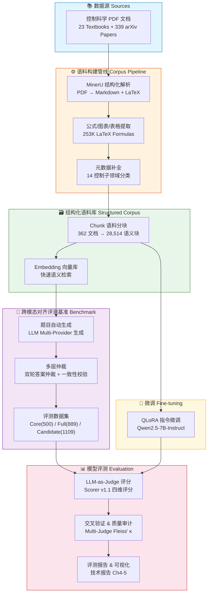
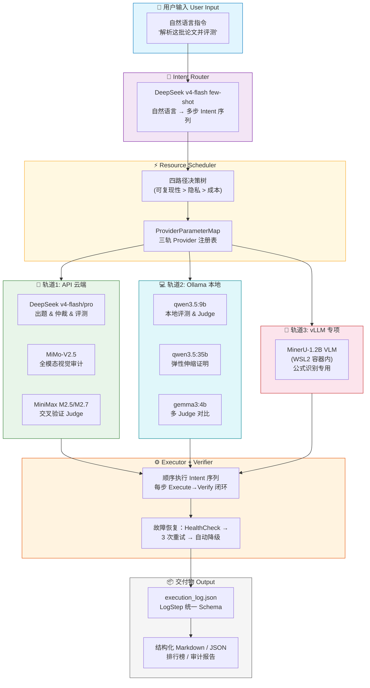

# ControlSci Benchmark

> 控制科学领域首个结构化跨模态对齐评测基准 + 全 AI 驱动科学文档智能体 / The First Structured Cross-Modal Alignment Benchmark for Control Science + AI-Driven Scientific Document Agent

> Public release note: this branch is a curated reviewer/public package. It contains the core runtime, reproducible scripts, public submission reports, and traceable evidence bundle under `docs/submissions/`. Raw corpora, private medical indexes, finetune outputs, scratch work, and internal planning notes stay on the private research branch.

[](https://creativecommons.org/licenses/by/4.0/)
[](https://huggingface.co/MorningStar0709/control-sci-corpus)
[](https://www.python.org/)
[](https://github.com/MorningStar0709/control-sci/actions/workflows/ci.yml)
[](docs/submissions/shared/DATA-TRACE.md)

***

## 双赛道 / Dual-Track Overview

**ControlSci** 同时参赛 2026 MinerU 挑战赛的两个赛道，同一套核心资产在两个赛道扮演不同角色：

|  <br />  | **赛道一 (AGI4S 前沿语料)**                               | **赛道二 (智能体与数据工程)**                            |
| :------: | :------------------------------------------------- | :-------------------------------------------- |
|  **定位**  | 控制科学跨模态对齐评测基准                                      | 科学文档跨模态语料智能体                                  |
| **核心产出** | 500 题评测集 + 9 模型排行榜                                 | 13 Intent + 三轨引擎 + 数据飞轮                       |
| **核心报告** | [技术报告](docs/submissions/track1_sci_align_report.md)                   | [Agent 技术报告](docs/submissions/track2_agent_report.md) |
| **一键复现** | `build_benchmark.ps1` + `run_evaluation.ps1`       | `run_agent.ps1`                               |
| **全量追溯** | [DATA-TRACE.md](docs/submissions/shared/DATA-TRACE.md) + [data_trace_bundle](docs/submissions/data_trace_bundle/README.md) | 同上                                            |

> 同一批 9 个模型在两个赛道扮演答题者与裁判双重身份——4.4GB Gemma3 评分 (0.872) > 23GB 35B (0.233) 的**评分者反规模定律**正是这种双重身份赋予的独特视角。

***

## 赛道一 / Track 1: Cross-Modal Alignment Benchmark

**ControlSci** 是面向控制科学（Control Science）领域的跨模态对齐评测基准，采用 **四维评测体系**（概念回溯 / 多步推理 / 条件敏感性 / 开放设计），覆盖 **14 个控制子领域**，基于 **23 本经典教材** 和 **339 篇 arXiv 论文** 构建。项目由全 AI 驱动的结构化语料构建管线（MinerU 解析 + Embedding 快速通道 + LLM 深度仲裁）从原始 PDF 自动抽取生成，经过多层自动化一致性校验，最终产出 **500 题核心评测集**（A/B/C/D 各 125 题完美平衡）。

**ControlSci** is the first structured cross-modal alignment benchmark specifically designed for Control Science. It employs the **four-dimensional evaluation framework** (Concept Retrieval / Multi-step Reasoning / Condition Sensitivity / Open-ended Design), covering **14 control subfields**. Built from **23 classic textbooks** and **339 arXiv papers**, the entire pipeline — from raw PDF parsing via MinerU to multi-round LLM arbitration — is AI-driven, producing a rigorously validated **500-question core set** (125 per dimension, perfectly balanced).

### 核心指标 / Key Metrics

| 指标 Metric                  | 数值 Value                                    |
| -------------------------- | :------------------------------------------ |
| 核心评测集 Core Set             | **500 题** (A/B/C/D 各 125)                   |
| 全量可用集 Full Set             | **889 题**                                   |
| 候选池 Candidate Pool         | **1,109 题**                                 |
| 语料来源 Source Documents      | 23 本教材 + 339 篇 arXiv 论文                     |
| LaTeX 公式总数 Total Formulas  | **253,012** 条                               |
| 控制子领域 Subfields            | **14** 个                                    |
| 难度等级 Difficulty Levels     | L1 – L4                                     |
| 已评测模型 Evaluated Models     | **9** 模型 (DeepSeek / MiMo / Qwen / MiniMax) |
| 跨模态可追溯索引 Cross-Modal Index | **500 题 100% 匹配** — 每题可追溯至 chunk 级图片/公式计数   |

***

### 赛道一架构 / Track 1 Architecture



> 上图展示了 ControlSci 从原始 PDF 到评测报告的完整数据流：MinerU 解析 → 语料库构建 → 题目生成与仲裁 → 9 模型评测 → QLoRA 微调反馈闭环。\
> The diagram above illustrates the end-to-end data flow: from raw PDFs through MinerU parsing, corpus construction, question generation & arbitration, to 9-model evaluation and the QLoRA fine-tuning feedback loop.

### 🖼️ 跨模态可追溯索引 / Cross-Modal Traceability Index

每道评测题通过 `source_ref` 字段可精确追溯到原始语料 chunk（`multimodal_index.json`），包含 **image_count**（图片数）、**formula_count**（公式数）、**cooccurrence_type**（共现类型）和 **chunk_path**（文件路径）。500 题 **100% 匹配**，其中 **74 题（14.8%）** 的源 chunk 同时包含图片与公式，为跨模态对齐研究提供了可审计的数据基础。

Each evaluation question is traceable to its source corpus chunk via `source_ref`, with `image_count`, `formula_count`, `cooccurrence_type`, and `chunk_path` recorded in `multimodal_index.json`. All **500 questions achieve 100% match rate**, with **74 (14.8%)** mapping to chunks containing both images and formulas — providing an auditable foundation for cross-modal alignment research.

***

## 赛道二 / Track 2: ControlSci Data Agent

**ControlSci Data Agent** 是面向科学文档的跨模态语料智能体，采用 **12 Intent × LLM Intent Router + 三轨推理引擎** 架构。Agent 能自主理解科学文档处理需求、规划多步执行路径、调用三轨推理引擎（API DeepSeek/MiMo/MiniMax + Ollama 本地 9B/35B + vLLM WSL2 MinerU-1.2B VLM）+ MinerU 文档解析，完成从原始 PDF 到结构化跨模态评测数据集的全链路自主生产。

**ControlSci Data Agent** is a scientific document cross-modal corpus agent powered by a **12-intent × LLM Intent Router + tri-track inference engine** architecture. It autonomously understands document processing needs, plans multi-step execution paths, and orchestrates three tracks (API DeepSeek/MiMo/MiniMax + Ollama local 9B/35B + vLLM WSL2 MinerU-1.2B VLM) with MinerU document parsing to complete the end-to-end pipeline from raw PDFs to structured cross-modal evaluation datasets.

### 核心指标 / Key Metrics

| 指标 Metric | 数值 Value |
|-------------|:-----------|
| 可编排 Intent | **13** (arxiv_search ~ reproduce_all) |
| 推理轨道 | **3** (API / Ollama / vLLM) |
| 资源调度路径 | **4** (API / Ollama / vLLM / Script 降级) |
| 端到端闭环 | **D 数据飞轮** 6-step 自主执行 (391s) |
| API 评测成本 | **< ¥50** (500 题全量) |
| 本地隐私路径 | **¥0** (Ollama + MinerU 纯本地) |
| 全量代码基 | **~170 KB** (9 个核心 .py) |
| Git 迭代密度 | **79+ commits** / 8 天 (Phase 0 → 终局) |
| 容错层级 | **4 级** (Provider / Step / Task / Process) |
| 自研 Trae Skill | **3 个** (mineru-to-md / search-arxiv / retrospective) |

### 赛道二架构 / Track 2 Architecture



**三轨推理引擎**：同一台 RTX 5090 上运行 API (DeepSeek/MiMo)、Ollama 本地 (Qwen/Gemma)、vLLM (MinerU-1.2B VLM, WSL2 容器内)。ResourceScheduler 按任务类型自动路由。文档解析通用能力 (MinerU API) 作为工具链被所有轨道调用。

> 完整设计见 [Agent 技术报告 §1](benchmark/agent/agent_report.md)。架构可视化见 [system_architecture.png](docs/assets/system_architecture.png)。

**13 Intent 能力矩阵**：arxiv_search / mineru_parse / corpus_parse / cross_modal_audit / corpus_quality_report / benchmark_build / quality_arbitrate / model_evaluate / multi_judge_compare / leaderboard_viz / local_finetune / multi_format_parse / reproduce_all — 覆盖从论文检索到排行榜更新的全链路。

***

## 快速开始 / Quick Start

### 环境要求 / Requirements

- **Python** 3.12+
- **Conda** (推荐) 或 venv
- **Ollama** (可选 — 用于本地模型零成本评测)

### 1. 克隆仓库 / Clone

```bash
git clone https://github.com/MorningStar0709/control-sci.git
cd control-sci
```

> ☁️ **在线体验** — 无需本地环境，[点开 Colab Notebook](https://colab.research.google.com/github/MorningStar0709/control-sci/blob/main/notebooks/control_sci_demo.ipynb) 即可加载数据集、浏览样例题和排行榜。

### 2. 创建环境 / Setup Environment

```bash
conda create -n myenv python=3.12 -y
# 核心依赖（评测管线）
conda run -n myenv pip install -r requirements.txt

# 可选：训练 Demo 依赖（需要 GPU）
conda run -n myenv pip install datasets transformers torch
```

### 3. 加载数据集 / Load Dataset

**Python 本地加载 / Local JSON:**

```python
import json

with open("benchmark/dataset/core.json", "r", encoding="utf-8") as f:
    data = json.load(f)

print(f"核心集样本数 / Core samples: {len(data['questions'])}")
# 输出 / Output: 500
```

**HuggingFace Datasets 加载:**

```python
from datasets import load_dataset

dataset = load_dataset("MorningStar0709/control-sci-corpus", split="core")
print(dataset[0])
```

### 4. 赛道一：运行评测 / Track 1 — Run Evaluation

**API 模型 (DeepSeek / MiMo / MiniMax):**

```bash
conda run -n myenv python benchmark/eval/evaluate.py --mode model \
  --input benchmark/dataset/core.json \
  --target-model deepseek-v4-flash \
  --target-base-url https://api.deepseek.com \
  --output reports/deepseek_report.json
```

**本地模型 (Ollama — 零成本):**

```bash
# 先拉取模型
ollama pull qwen3.5:9b

# 运行评测
conda run -n myenv python benchmark/eval/evaluate.py --mode model \
  --input benchmark/dataset/core.json \
  --target-model qwen3.5:9b \
  --target-base-url http://localhost:11434/v1 \
  --target-api-key ollama \
  --output reports/qwen_report.json
```

### 5. 赛道二：运行 Agent / Track 2 — Run Data Agent

Agent 支持 13 种 intent，通过自然语言输入驱动：

```bash
# 交互模式：输入自然语言任务描述
conda run -n myenv python benchmark/agent/agent_cli.py

# 单 Intent：arXiv 论文检索
conda run -n myenv python benchmark/agent/agent_cli.py "检索 2025 年控制科学前沿论文"

# 单 Intent：跨模态视觉审计
conda run -n myenv python benchmark/agent/agent_cli.py "审计语料中的跨模态对齐质量"

# 全链路：数据飞轮 6 步闭环（检索→解析→出题→仲裁→评测→排行榜）
conda run -n myenv python benchmark/agent/agent_cli.py --mode flywheel
```

> 完整 intent 列表和配置见 [Agent 能力矩阵](benchmark/agent/agent_capabilities.json) 和 [Agent 报告 §1](benchmark/agent/agent_report.md)。本地模式加 `--local` 全路径切换至 Ollama。

### 6. 一键复现 / One-Click Reproduction

| 入口脚本                    |  赛道 | 职责                                |
| :---------------------- | :-: | :-------------------------------- |
| `.\build_benchmark.ps1` |  一  | 语料→元数据→出题→仲裁→拆分→验证 (Mock 模式零 API) |
| `.\run_evaluation.ps1`  |  一  | core.json→9 模型评测→Leaderboard      |
| `.\run_agent.ps1`       |  二  | Agent 全部 13 intent 一键复现           |

> Mock 模式为确定性输出，零 API 调用。API 模式需配置 Provider Key 环境变量（如 `OPENAI_API_KEY`）。

> 完整参数说明与高级用法请参见 [benchmark/README.md](benchmark/README.md)、[benchmark/eval/](benchmark/eval/) 和 [Agent 技术报告](benchmark/agent/agent_report.md)。\
> Full parameter reference and advanced usage: see [benchmark/README.md](benchmark/README.md), [benchmark/eval/](benchmark/eval/), and [Agent Report](benchmark/agent/agent_report.md).

***

## 赛道一：四维评测体系 / Track 1 — Four-Dimensional Framework

四维评测体系是一套专为科学推理场景设计的评测框架，从四个层次考察 LLM 在控制科学领域的推理能力：

| 维度 Dim | 名称 Name                       | 考察能力 Capability    | 题数 Qs |
| :----: | ----------------------------- | ------------------ | :---: |
|  **A** | 概念回溯 / Concept Retrieval      | 领域概念定义、定理陈述、公式物理意义 |  125  |
|  **B** | 多步推理 / Multi-step Reasoning   | 逐步推导、参数设计、逻辑连贯性    |  125  |
|  **C** | 条件敏感性 / Condition Sensitivity | 参数变化→性能演变趋势分析      |  125  |
|  **D** | 开放设计 / Open-ended Design      | 完整控制方案设计与工程综合      |  125  |

> 每个维度 125 题，难度均匀覆盖 L1（基础）→ L4（挑战）四个等级。详见 [HuggingFace Dataset Card](https://huggingface.co/MorningStar0709/control-sci-corpus)。\
> Each dimension contains 125 questions, with difficulty uniformly distributed across L1 (Basic) to L4 (Challenging).

***

## 赛道一：评测结果 / Track 1 — Evaluation Leaderboard

|  #  | 模型 Model                   |  类型 Type  | 总分 Score | A 概念 | B 推理 |   C 敏感性  |   D 设计   |
| :-: | -------------------------- | :-------: | :------: | :--: | :--: | :------: | :------: |
|  1  | **MiMo-v2-flash**          |    API    | **64.7** | 61.0 | 60.6 |   63.6   | **73.6** |
|  2  | **DeepSeek-v4-flash**      |    API    | **63.2** | 63.4 | 63.1 |   71.4   |   55.0   |
|  3  | **Qwen3.5-9B** 🏠          | 本地 Ollama | **62.5** | 56.9 | 61.0 |   66.2   |   65.9   |
|  4  | **DeepSeek-v4-pro**        |    API    | **61.9** | 62.7 | 59.0 | **74.2** |   51.4   |
|  5  | **MiniMax-M2.5-highspeed** |    API    | **60.2** | 63.8 | 51.9 |   62.4   |   62.6   |
|  6  | **MiniMax-M2.7-highspeed** |    API    | **57.4** | 60.5 | 48.5 |   61.2   |   59.3   |
|  7  | **MiMo-v2.5-pro**          |    API    | **53.9** | 59.5 | 52.3 |   60.2   |   43.6   |
|  8  | **MiMo-v2-pro**            |    API    | **51.4** | 63.8 | 49.0 |   56.0   |   36.9   |
|  9  | **MiMo-v2.5**              |    API    | **44.0** | 60.8 | 46.6 |   52.8   |   15.6   |

> 🏠 Qwen3.5-9B 为本地 Ollama 部署，是唯一参数量 ≤9B 的本地模型，以 **62.5** 总分超越 6 个商业 API 模型，验证了本基准的硬件友好性。\
> 评分方案：LLM-as-Judge（DeepSeek-v4-flash），三 Judge 交叉验证 Fleiss' κ = 0.575。详见技术报告 [§4 评测结果](docs/technical_report.md)。

***

## 赛道一：指令微调 / Track 1 — Instruction Fine-tuning

ControlSci 数据集遵循 **"评测 → 微调 → 闭环"三层消费模型**，支持从零评测到领域微调的全链路 AI 使用场景。`full.json`（889 题）提供完整的 `question` / `answer` / `reasoning_steps` 字段，可直接转化为 instruction → response 格式用于 QLoRA/SFT 等参数高效微调。

The dataset follows a **three-layer consumption model** (Evaluation → Fine-tuning → Closed-loop), supporting end-to-end AI workflows. The `full.json` (889 questions) provides complete `question` / `answer` / `reasoning_steps` fields ready for instruction tuning via QLoRA/SFT.

### HuggingFace Datasets 微调示例 / Fine-tuning Example

```python
from datasets import load_dataset

# 加载全量指令微调集（889 题）
dataset = load_dataset("MorningStar0709/control-sci-corpus", "full", split="train")

# 格式化为 instruction → response
def format_instruction(example):
    return {"text": f"### 问题\n{example['question']}\n\n### 参考答案\n{example['answer']}"}

train_data = dataset.map(format_instruction)
print(f"微调数据: {len(train_data)} 条")

# 按难度分层抽样
l4_hard = dataset.filter(lambda x: x["difficulty_level"] == "L4")
print(f"L4 挑战级: {len(l4_hard)} 条 — 适合针对性指令微调")
```

> ⚠️ 训练 Demo 需要 **NVIDIA GPU（≥8GB VRAM）**。评测管线（validate + evaluate + leaderboard）仅需 CPU + API Key。
>
> 🔧 **完整训练 Demo**：[Colab Notebook](https://colab.research.google.com/github/MorningStar0709/control-sci/blob/main/notebooks/control_sci_demo.ipynb) 含 `load_dataset → format → trainer.train()` 零适配示例。本机 RTX 5090 24GB 跑 Qwen2.5-1.5B-Instruct 10 条 < 2min。\
> **数据用途详情**参见 [benchmark/dataset/README.md](benchmark/dataset/README.md) 「数据用途（三层定位）」章节。

***

## 项目结构 / Project Structure

```
ControlSci/
├── README.md                         # 项目主文档（本文件）
├── LICENSE                           # CC-BY-4.0 开源协议
├── .gitignore
├── build_benchmark.ps1               # 赛道一：Benchmark 构建 (原 reproduce.ps1)
├── reproduce.sh                      # 一键复现脚本 (Linux Bash)
├── run_evaluation.ps1                # 赛道一：评测管线 (原 reproduce_eval.ps1)
├── run_agent.ps1                     # 赛道二：Agent 全链路 (原 reproduce_all.ps1)
│
├── pipeline/                         # 核心语料构建管线 (18 脚本)
│   ├── build_corpus.py               #   从源文档构建语料库
│   ├── chunk_corpus.py               #   语料语义分块 (28,514 chunks)
│   ├── stats_corpus.py               #   语料统计
│   ├── clean_formulas.py             #   LaTeX 公式清洗
│   ├── clean_tables.py               #   表格清洗
│   ├── complete_metadata.py          #   元数据补全
│   ├── check_contamination.py        #   污染检测
│   ├── launcher.py                   #   批次启动器
│   └── ...                           #   更多处理脚本
│
├── benchmark/                        # 跨模态对齐评测基准
│   ├── README.md                     #   基准文档 & 高级用法
│   ├── dataset/                      #   评测数据集
│   │   ├── core.json                 #     核心集 (500 题, A/B/C/D 各 125)
│   │   ├── full.json                 #     全量集 (889 题)
│   │   ├── merged.json               #     候选池 (1,109 题)
│   │   └── schema.json               #     数据 Schema 定义
│   ├── eval/                         #   评测引擎
│   │   ├── evaluate.py               #     评测入口 (API / Ollama 双模式)
│   │   ├── judge.py                  #     LLM-as-Judge 评分器
│   │   ├── report.py                 #     报告生成
│   │   ├── run_eval_multi.ps1        #     多模型并行评测启动
│   │   ├── cross_domain_eval.py      #     跨学科泛化评测
│   │   ├── embedding_analysis.py     #     嵌入向量分析
│   │   ├── quality_audit.py          #     质量审计
│   │   ├── dimension_waterfall.py    #     维度瀑布图
│   │   ├── validate_dataset.py       #     数据集完整性校验
│   │   ├── self_correction_test.py   #     自修正轨迹实验
│   │   ├── formula_density.py        #     公式密度分析
│   │   └── results/                  #     评测结果 & 报告
│   │       ├── leaderboard.json      #       排行榜 JSON
│   │       ├── leaderboard.html      #       排行榜 HTML (可视化)
│   │       └── report_4.*.md         #       逐维度分析报告
│   ├── pipeline/                     #   题目生成管线
│   │   ├── build_benchmark.py        #     从语料生成评测题
│   │   ├── arbiter.py                #     双轮答案仲裁 (3-worker)
│   │   ├── orphan_judge.py           #     孤儿题自动回收
│   │   ├── merge_benchmarks.py       #     多路生成合并
│   │   ├── split_benchmark.py        #     Core/Full 拆分
│   │   └── export_dataset.py         #     数据集导出
│   ├── generator/                    #   生成器子包
│   │   ├── api.py                    #     LLM API 调用封装
│   │   ├── prompts.py                #     Prompt 模板
│   │   ├── distribution.py           #     四维难度分布控制
│   │   └── quality.py                #     质量控制 (两轮自验)
│   └── agent/                        #   赛道二：ControlSci Data Agent (13 intent)
│       ├── agent_cli.py              #     CLI 入口 (1,742 行, 含 12 handler)
│       ├── agent.py                  #     核心 Agent 编排
│       ├── resource_scheduler.py     #     三轨资源调度器 (759 行)
│       ├── visual_audit.py           #     跨模态视觉审计 (MiMo-V2.5)
│       ├── agent_capabilities.json   #     13 Intent 能力注册表
│       ├── agent_report.md           #     Agent 技术报告 (赛道二交付)
│       ├── log_schema.py             #     日志 Schema 定义
│       ├── _validate_capabilities.py #     验收测试
│       ├── _verify_10_intents.py     #     Intent 全量验证
│       └── examples/                 #     任务示例脚本
│
├── finetune/                         # QLoRA 微调实验
│   ├── config/qlora_config.yaml      #   QLoRA 训练配置
│   ├── data/                         #   训练/验证/测试数据集
│   ├── output/                       #   训练 Checkpoint & 最终产出
│   └── scripts/                      #   QLoRA 训练 & 评测脚本
│       ├── train_qlora.py            #     微调训练入口
│       ├── eval_4b_baseline.py       #     4B 基线评测
│       ├── eval_finetuned.py         #     微调后评测
│       └── judge_parallel.py         #     并行 Judge
│
├── analyze/                          # 评测深度分析
│   ├── analyzers/                    #   7 个分析器 (维度/类目/推理/厂商/一致性/孤本/多样性)
│   ├── charts/                       #   图表渲染 (HTML)
│   └── run_all.py                    #   一键分析入口
│
├── docs/                             # 文档中心
│   ├── DATA-TRACE.md                 #   全量数字可追溯索引 (86 条目)
│   ├── technical_report.md           #   赛道一完整技术报告
│   ├── assets/architecture.png       #   架构图
│   ├── assets/system_architecture.png#   三轨推理引擎架构图
│   ├── reports/                      #   各阶段报告
│   ├── plans/                        #   实现计划
│   ├── handoffs/                     #   阶段交接文档
│   └── retrospectives/               #   回顾沉淀 (22 份)
│
├── notebooks/                        # Jupyter Notebook
│   └── control_sci_demo.ipynb        #   Colab 交互式 Demo
│
├── corpus/                           # 语料库元数据
├── data/                             # 数据源清单
├── dataset/                          # 衍生数据集
│
├── huggingface/                      # HuggingFace 发布产物
│   └── control-sci-corpus/
│
├── controlsci/                       # 核心 API、Medical RAG 与复现运行时
├── run_reviewer_demo.ps1             # 评委快速验证入口
├── run_minimal_repro.ps1             # 最小真实闭环复现入口
├── _ppt_materials/                   # PPT 素材
└── .trae/                            # IDE 配置
```

***

## 赛道一：覆盖的控制子领域 / Track 1 — Covered Control Subfields

语料覆盖 **14 个控制子领域**，核心集 500 题使用 10 个细粒度标签标注：

| 子领域 Subfield       |    标签 Tag   | 子领域 Subfield       |     标签 Tag    |
| :----------------- | :---------: | :----------------- | :-----------: |
| 经典控制 Classical     | `classical` | 智能控制 Intelligent   | `intelligent` |
| 最优控制 Optimal       |  `optimal`  | 模型预测控制 MPC         |     `mpc`     |
| 鲁棒控制 Robust        |   `robust`  | 自适应控制 Adaptive     |   `adaptive`  |
| 非线性控制 Nonlinear    | `nonlinear` | 数字控制 Digital       |   `digital`   |
| 现代控制 Modern        |   `modern`  | 多智能体协同 Multi-agent | `multi_agent` |
| PID 控制 PID Control |  *(corpus)* | 估计与定位 Estimation   |   *(corpus)*  |
| 滑模控制 Sliding Mode  |  *(corpus)* | H∞ 控制 H∞ Control   |   *(corpus)*  |

> 核心集 500 题使用 10 个标签精确标注（上表前5行），语料库覆盖全部 14 个子领域。\
> Core set 500 questions use 10 fine-grained tags (first 5 rows); the corpus covers all 14 subfields.

***

## 引用 / Citation

本项目提供 [CITATION.cff](CITATION.cff) 标准引用文件（GitHub / Zenodo 双平台自动识别）。

如果您在研究中使用了 ControlSci Benchmark，请引用：

If you use ControlSci Benchmark in your research, please cite:

```bibtex
@misc{controlscibenchmark2026,
  title        = {ControlSci: A Structured Corpus and Sci-Align Benchmark for Control Science},
  author       = {{MorningStar}},
  year         = {2026},
  howpublished = {\url{https://github.com/MorningStar0709/control-sci}},
  note         = {CC-BY-4.0 licensed}
}
```

***

## 许可 / License

本项目采用 [CC-BY-4.0](https://creativecommons.org/licenses/by/4.0/) 协议开源。您可以自由地共享、改编本数据集，惟需适当署名。

This project is open-source under the [CC-BY-4.0](https://creativecommons.org/licenses/by/4.0/) license. You are free to share and adapt the dataset, provided you give appropriate credit.

***

## 致谢 / Acknowledgments

- [MinerU](https://github.com/opendatalab/MinerU) — 高质量 PDF 结构化解析引擎 / High-quality PDF structured parsing engine
- 23 本控制科学经典教材的作者与出版方 / Authors and publishers of 23 classic control science textbooks
- arXiv 预印本平台上的 339 篇开放获取论文 / 339 open-access papers on arXiv
- 参与一致性校验的领域专家与志愿者 / Domain experts and volunteers who participated in consistency validation
