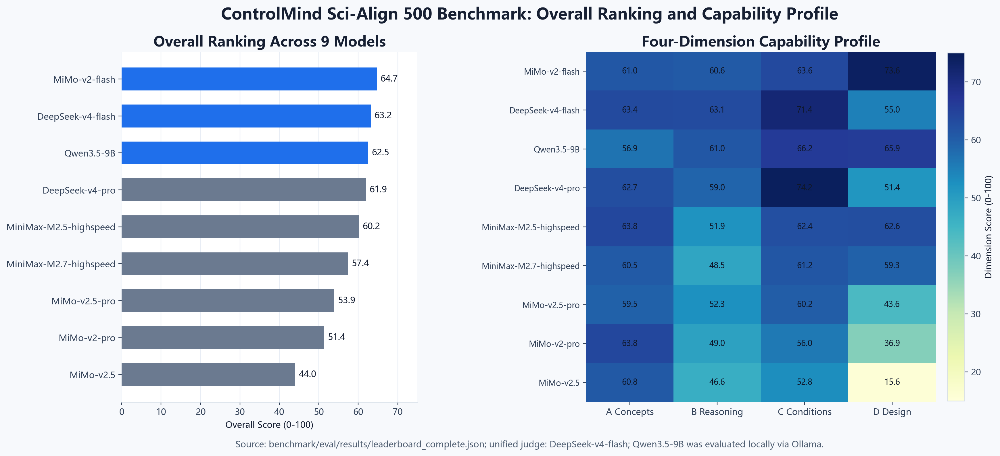

# ControlMind

**A MinerU-powered scientific document intelligence system: 500-question cross-modal benchmark, 14-intent data agent, and local-first medical RAG — all from raw PDFs.**

[Chinese version](README.zh.md) | [CC-BY-4.0](LICENSE)

```text
Track 1  Sci-Align  —  4-dimension control-science evaluation benchmark
Track 2  Data Agent —  14-intent autonomous corpus agent with 4-path scheduling
Track 3  Medical RAG —  local-first evidence-grounded clinical literature Q&A
```

---


*ControlMind system architecture: a single RTX 5090 runs the full pipeline — MinerU parsing, tri-engine inference (API / Ollama / vLLM), and multi-index RAG.*

---

## What This Project Does

| Track | What You Get | One Command |
|:---|:---|:---|
| **Sci-Align** | A 500-question 4-dimension benchmark (A: Concept Recall, B: Multi-step Reasoning, C: Condition Sensitivity, D: Open Design) with 9-model leaderboard and full source traceability. Loadable via `load_dataset()`. | `load_dataset("MorningStar0709/control-sci-corpus")` |
| **Data Agent** | A 14-intent autonomous agent that searches arXiv, parses PDFs with MinerU, audits cross-modal alignment, builds benchmarks, evaluates models, and self-corrects on failure — with unified logging and checkpoint recovery. | `controlmind track2 validate --artifact all` |
| **Medical RAG** | A local-first evidence Q&A system over 97 parsed PMC papers, with IMRAD-aware chunking, hybrid FAISS+BM25 retrieval, Chinese-to-English query bridging, visual injection, and safety-refusal boundaries. | `controlmind track3 eval --case-set zh_ask` |

---

## Quick Start

```bash
pip install -r requirements.txt
pip install -e .
controlmind doctor
```

Load the Sci-Align benchmark dataset:

```python
from datasets import load_dataset

core = load_dataset("MorningStar0709/control-sci-corpus", "core", split="train")
print(len(core))       # 500
print(core[0]["question"])
```

Run per-track quick checks:

```bash
controlmind track1 validate --sample 4
controlmind track2 validate --artifact all
controlmind track3 eval --case-set zh_ask
```

> **Windows users:** prepend `conda run -n myenv python -m controlsci.cli` if not using `pip install -e .`. PowerShell scripts (`run_reviewer_demo.ps1`, `run_frontend.ps1`) are also provided.

---

## Local Demo

```powershell
.\run_frontend.ps1 -StartBackend
```

Starts the backend API at `http://127.0.0.1:17001` and the frontend at `http://127.0.0.1:3000`. Requires Python (FastAPI) and Node.js.

---

## Key Results

| Metric | Value |
|:---|---:|
| Documents parsed | 362 (23 textbooks + 339 arXiv papers) |
| Structured chunks | 28,514 |
| LaTeX formulas extracted | 253,012 |
| Image-formula co-occurrence pairs | 4,996 (9,207 audit judgments) |
| Benchmark questions | 500 (A/B/C/D = 125 each, 14 sub-domains) |
| Models evaluated | 9 |
| PMC medical papers | 97 parsed, 3,348 medical chunks |
| QLoRA fine-tuning | 4B/9B variants, perplexity-probed |

---

## Leaderboard — ControlSci Sci-Align Benchmark

| Rank | Model | Overall | A: Concept | B: Reasoning | C: Sensitivity | D: Design |
|:---:|:---|:---:|:---:|:---:|:---:|:---:|
| 1 | **MiMo-v2-flash** | **0.647** | 0.610 | 0.606 | 0.636 | 0.736 |
| 2 | DeepSeek-v4-flash | 0.632 | 0.634 | 0.631 | 0.714 | 0.550 |
| 3 | Qwen3.5-9B | 0.625 | 0.569 | 0.610 | 0.662 | 0.659 |
| 4 | DeepSeek-v4-pro | 0.619 | 0.627 | 0.590 | 0.742 | 0.514 |
| 5 | MiniMax-M2.5-highspeed | 0.602 | 0.638 | 0.519 | 0.624 | 0.626 |
| 6 | MiniMax-M2.7-highspeed | 0.574 | 0.605 | 0.485 | 0.612 | 0.593 |
| 7 | MiMo-v2.5-pro | 0.539 | 0.595 | 0.523 | 0.602 | 0.436 |
| 8 | MiMo-v2-pro | 0.514 | 0.638 | 0.490 | 0.560 | 0.369 |
| 9 | MiMo-v2.5 | 0.440 | 0.608 | 0.466 | 0.528 | 0.156 |

All scores verified by LLM-as-Judge with cross-validation. Full results and analysis in [`benchmark/eval/results/`](benchmark/eval/results/).



---

## Reports

Each track has a companion technical report with detailed methodology, experiments, and traceable evidence:

| Track | Report | Key Evidence |
|:---|:---|:---|
| Track 1 Sci-Align | [track1_sci_align_report.md](docs/submissions/track1_sci_align_report.md) | 500-question schema, 9-model leaderboard, QLoRA results |
| Track 2 Data Agent | [track2_agent_report.md](docs/submissions/track2_agent_report.md) | 14-intent protocol, dry-run logs, failure recovery cases |
| Track 3 Medical RAG | [track3_medical_rag_report.md](docs/submissions/track3_medical_rag_report.md) | 97 PMC papers, Chinese Ask traces, MedBench comparison |

Every quantitative claim in the reports points back to source files, commands, or hashes in [`DATA-TRACE.md`](docs/submissions/shared/DATA-TRACE.md).

---

## Public Entry Points

| Item | Link |
|:---|:---|
| Cloud Demo | [demo.askiler.com](https://demo.askiler.com/) (code: `ControlMind@2026`) |
| HuggingFace Dataset | [MorningStar0709/control-sci-corpus](https://huggingface.co/datasets/MorningStar0709/control-sci-corpus) |
| Reproducibility Guide | [REPRODUCIBILITY.md](REPRODUCIBILITY.md) |
| Evidence Bundle | [docs/submissions/data_trace_bundle/](docs/submissions/data_trace_bundle/) |

---

## Repository Map

```text
Source & CLI
  controlsci/                  Python package (controlmind CLI)
  benchmark/                   Benchmark engine, Agent orchestration, datasets
  benchmark/dataset/           Core/full/schema JSON, multimodal index
  benchmark/eval/              Evaluation, leaderboard & medical RAG scripts
  tools/                       MinerU utilities & analysis scripts
  npm/controlmind/             Optional Node.js CLI launcher

Data & Corpus
  corpus/chunks/               28,514 structured chunks from 362 documents
  data/sources_medical/        Medical corpus, chunks, FAISS/BM25 indexes
  data/sources_flywheel/       Agent flywheel papers & parse results

Reports & Pipeline
  docs/submissions/            Technical reports, DATA-TRACE, evidence bundle
  _final_submission_by_track/  Per-track final submission packages
  pipeline/                    Corpus construction pipeline scripts
  notebooks/                   Colab demo & E3b training screenshot
  starboard/                   Local & cloud demo frontend (Next.js)
```

---

## License & Data Boundary

- This project is released under **CC-BY-4.0**. See [LICENSE](LICENSE).
- Public PMC/arXiv source documents retain their original licenses and attribution.
- Patient-level private data is **not** included.
- Cloud demo inputs are limited to public or sanitized materials; medical chunks, indexes, and RAG contexts are local-first by default.

---

## Citation

```bibtex
@misc{controlmind2026,
  title        = {ControlMind: MinerU-based Scientific Document Intelligence for Sci-Align, Data Agent, and Medical RAG},
  author       = {MorningStar},
  year         = {2026},
  howpublished = {\url{https://github.com/MorningStar0709/control-sci}},
  note         = {ControlSci benchmark released under CC-BY-4.0}
}
```
