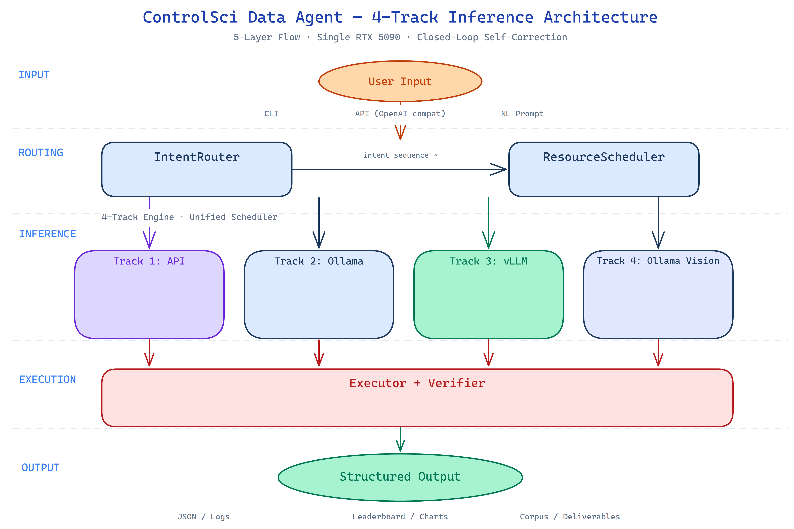

# ControlMind

**基于 MinerU 的科学文档智能系统：500 题跨模态评测基准、14-Intent 数据智能体、本地优先的医学 RAG 管线 —— 全链路从原始 PDF 到结构化知识。**

[English version](README.md) | [CC-BY-4.0](LICENSE)

```text
赛道一  Sci-Align  —  四维控制科学评测基准，9 模型全量排行榜
赛道二  Data Agent —  14 Intent 自主语料智能体，四路径资源调度
赛道三  Medical RAG —  本地优先的医学证据问答，中文桥接，安全拒答
```

---

## 一句话看懂

ControlMind 用 MinerU 将 362 篇控制科学文献（23 本教材 + 339 篇 arXiv 论文）解析为 28,514 个结构化 chunk 和 253,012 条 LaTeX 公式，并在此基础上：

- 构建了 **500 题四维评测基准**（A: 概念回溯 / B: 多步推理 / C: 条件敏感性 / D: 开放设计），覆盖 14 个控制科学子领域
- 实现了 **14-Intent 自主数据 Agent**，从文献检索到排行榜更新全链路自动化，单 RTX 5090 全栈部署
- 迁移至 **97 篇 PMC 医学文献**，构建了本地优先的中英文证据问答系统

三份提交报告中的定量声明均可通过 [DATA-TRACE.md](docs/submissions/shared/DATA-TRACE.md) 回溯到源文件、命令或哈希记录。



*单张 RTX 5090：362 篇文档 → 28,514 个结构化块 → 三赛道完整闭环，跨语料知识迁移。*

---

## 三份报告导读

### 赛道一：Sci-Align 控制科学评测基准

> 📄 [track1_sci_align_report.md](docs/submissions/track1_sci_align_report.md)

**核心工作**：控制科学（Lyapunov 稳定性、Riccati 方程、LMI、模型预测控制）是自动驾驶、机器人、智能电网的基础数学语言，但 MMLU 等 6 个主流基准**零覆盖**。本项目用全 AI 驱动管线构建了首个控制科学专精评测集，并回答了 "LLM 是否真正理解控制科学的数学结构"。

**验证入口**：`load_dataset("MorningStar0709/control-sci-corpus")` 一行加载；`controlmind track1 validate --sample 4` 验证数据完整性。


### 赛道二：Data Agent 执行协议

> 📄 [track2_agent_report.md](docs/submissions/track2_agent_report.md)

**核心工作**：从 PDF 到排行榜，传统做法需要 ~558 人工工时。Agent 将这条链路抽象为 14 个可组合 intent，通过 Intent Router → ResourceScheduler → Executor → Verifier 四层架构自主执行，并以统一 LogStep 保留所有工具调用、产物和恢复路径。

**验证入口**：`controlmind track2 validate --artifact all` 检查 5 步验收 DAG、来源产物和 D 数据飞轮 391 秒 replay 日志。

### 赛道三：Medical RAG 医学证据问答

> 📄 [track3_medical_rag_report.md](docs/submissions/track3_medical_rag_report.md)

**核心工作**：97 篇 PMC 文献 → MinerU 保留版面/表格/图片 → 28 层级 IMRAD 语义切片 → FAISS+BM25 Hybrid 检索 → 中文 Ask + claim support + citation coverage + 安全拒答。核心洞察：RAG 幻觉的根源不在模型，而在检索上下文错配——本项目从文档入口第一步开始切断这条错误链。

**验证入口**：`controlmind track3 eval --case-set zh_ask` 输出 Hit@3、claim support 与中文 trace 摘要。

---

## 快速开始

```bash
pip install -r requirements.txt
pip install -e .
controlmind doctor
```

加载 Sci-Align 数据集：

```python
from datasets import load_dataset

core = load_dataset("MorningStar0709/control-sci-corpus", "core", split="train")
print(len(core))       # 500
print(core[0]["question"])
```

分赛道快速检查：

```bash
controlmind track1 validate --sample 4
controlmind track2 validate --artifact all
controlmind track3 eval --case-set zh_ask
```

> **Windows 用户**：如未 `pip install -e .`，可用 `conda run -n myenv python -m controlsci.cli` 替代。仓库也提供了 PowerShell 脚本入口（`run_reviewer_demo.ps1`、`run_frontend.ps1`）。

---

## 本地 Demo

```powershell
.\run_frontend.ps1 -StartBackend
```

启动后端 API（`http://127.0.0.1:17001`）和前端界面（`http://127.0.0.1:3000`）。需要 Python（FastAPI）和 Node.js。

---

## 关键数字

| 指标 | 数值 |
|:---|---:|
| 解析文档 | 362 篇（23 教材 + 339 arXiv） |
| 结构化 chunk | 28,514 |
| LaTeX 公式 | 253,012 条 |
| 图片-公式共现对 | 4,996（9,207 条跨模态审计判决） |
| 评测题 | 500（A/B/C/D 各 125，14 子领域） |
| 已评测模型 | 9 |
| PMC 医学文献 | 97 篇解析，3,348 个医学 chunk |

排行榜见 [leaderboard_complete.json](benchmark/eval/results/leaderboard_complete.json)。

---

## DATA-TRACE 核心条目速查

以下 15 条从 115 条完整 DATA-TRACE 中精选，覆盖三赛道核心声明：

| # | 赛道 | 声明 | 源文件 |
|:---:|:---|:---|:---|
| 1 | T1 | 语料规模 362 篇 1.3GB | `pipeline/stats_corpus.py` |
| 2 | T1 | 28,514 chunk / 253K 公式 | `pipeline/extract_stats.py` |
| 3 | T1 | A/B/C/D 各 125 题均衡 | `benchmark/dataset/core.json` |
| 4 | T1 | 500/500 source_ref 匹配 | `benchmark/dataset/multimodal_index.json` |
| 5 | T1 | 9 模型排行榜 | `benchmark/eval/results/leaderboard_complete.json` |
| 6 | T2 | 14 Intent 注册表 | `benchmark/agent/agent_capabilities.json` |
| 7 | T2 | 四路径调度日志 | `benchmark/agent/examples/logs/` |
| 8 | T2 | D 数据飞轮 replay 391s | `benchmark/agent/examples/logs/task_5_transfer.json` |
| 9 | T2 | 跨模态审计断点续跑 | `benchmark/agent/results/visual_audit_results.jsonl` |
| 10 | T3 | 97 篇 PMC 文献列表 | `data/sources_medical/` |
| 11 | T3 | 3,348 医学 chunk | `data/sources_medical/index/index_meta.json` |
| 12 | T3 | 中文 Ask trace | `data/sources_medical/index/medical_rag_zh_ask_traces.jsonl` |
| 13 | T3 | BGE-M3 中文 Hit@3=1.0 | `benchmark/eval/results/medical_rag_eval_zh_ask.json` |
| 14 | T3 | 视觉注入 AB 对比 | `data/sources_medical/vision/vision_ab_comparison.json` |
| 15 | ALL | 完整溯源索引 | `docs/submissions/shared/DATA-TRACE.md` |

---

## 公开入口

| 项目 | 链接 |
|:---|:---|
| 云端 Demo | [demo.askiler.com](https://demo.askiler.com/)（访问码：`ControlMind@2026`） |
| HuggingFace 数据集 | [MorningStar0709/control-sci-corpus](https://huggingface.co/datasets/MorningStar0709/control-sci-corpus) |
| 复现指南 | [REPRODUCIBILITY.md](REPRODUCIBILITY.md) |
| 证据包 | [docs/submissions/data_trace_bundle/](docs/submissions/data_trace_bundle/) |

---

## 仓库结构

```text
源码 & CLI
  controlsci/                  Python 包（controlmind CLI）
  benchmark/                   评测引擎、Agent 编排、数据集
  benchmark/dataset/           Core/full/schema JSON、多模态索引
  benchmark/eval/              评测、排行榜 & 医学 RAG 执行脚本
  tools/                       MinerU 工具 & 分析脚本
  npm/controlmind/             可选 Node.js CLI 启动壳

数据 & 语料
  corpus/chunks/               来自 362 篇文档的 28,514 个结构化 chunk
  data/sources_medical/        医学文献、chunk、FAISS/BM25 索引
  data/sources_flywheel/       Agent 飞轮抓取论文 & 解析结果

报告 & 管线
  docs/submissions/            技术报告、DATA-TRACE、证据包
  _final_submission_by_track/  按赛道拆分的最终提交包
  pipeline/                    语料构建管线脚本
  notebooks/                   Colab Demo & E3b 训练截图
  starboard/                   本地 & 云端 Demo 前端（Next.js）
```

---

## 许可与数据边界

- 本项目以 **CC-BY-4.0** 发布，详见 [LICENSE](LICENSE)。
- 公开 PMC/arXiv 原文遵循其原始许可与署名要求。
- 本仓库**不包含**患者级私有数据。
- 云端 Demo 输入限定为公开或脱敏材料；医学 chunk、索引与 RAG 上下文默认本地优先。

---

## 引用

```bibtex
@misc{controlmind2026,
  title        = {ControlMind: MinerU-based Scientific Document Intelligence for Sci-Align, Data Agent, and Medical RAG},
  author       = {MorningStar},
  year         = {2026},
  howpublished = {\url{https://github.com/MorningStar0709/control-sci}},
  note         = {ControlSci benchmark released under CC-BY-4.0}
}
```
