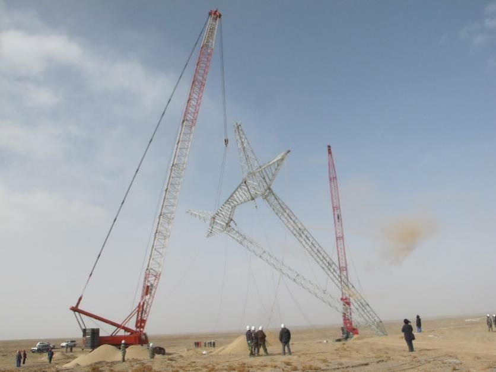
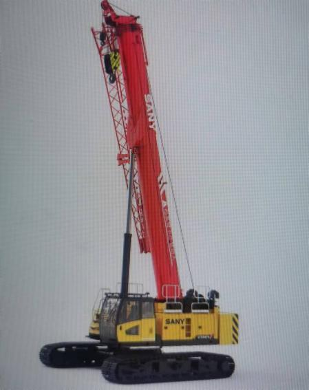
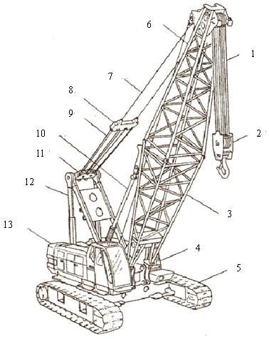
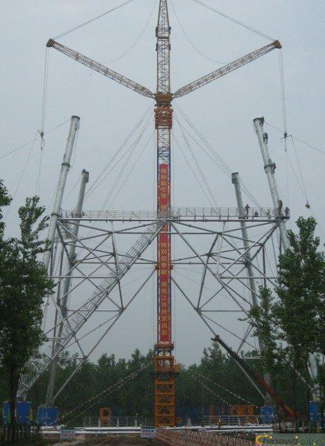
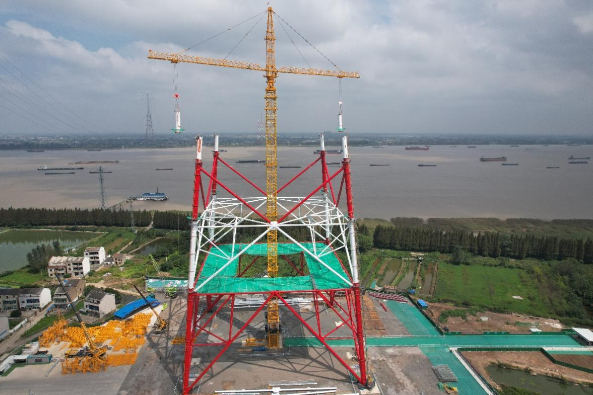
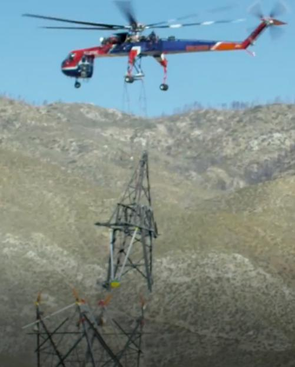
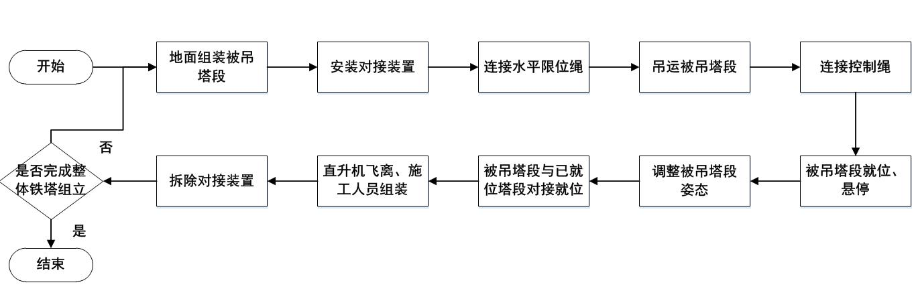
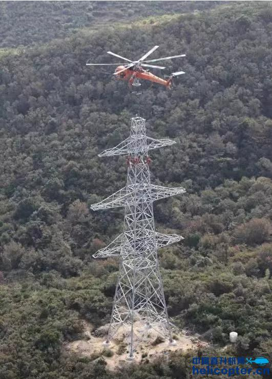
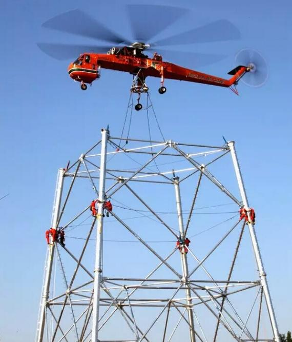

# **架空输电线路杆塔组立施工方法介绍**

输变电工程研究所 施工技术研究室

根据架空输电线路电压等级的不同，杆塔主要分为输电铁塔和输电杆（俗称电线杆），其中输电铁塔主要用于电压等级为110kV\~1000kV的架空输电线路，输电杆一般用于110kV以下的低电压等级架空输电线路。输电铁塔与输电杆相比，结构组成更加复杂，组立施工周期更长。

架空输电线路杆塔组立施工一般分为以下五个步骤：（1）塔材和组立设备运输与进场；（2）组立设备安装与就位；（3）塔材地面拼装；（4）塔材吊装；（5）组立设备拆卸或移除。

根据组立设备的不同，架空输电线路杆塔组立施工又分为流动式起重机（俗称吊车）组塔、落地抱杆组塔、直升机辅助组塔等。根据地形条件与杆塔规格，输电铁塔组立主要用到流动式起重机和落地抱杆，直升机辅助组塔使用情况较少，输电杆的组立仅用到流动式起重机，现已逐步淘汰人工组立。

上述组立设备各有特点，适用的地形与杆塔规格也各有侧重，导致组塔周期也长短不一。

## **1.流动式起重机**

**1.1装备概述**

流动式起重机是具有移动底盘的动臂起重机，在输电线路工程施工中可利用其分解组立或整体组立铁塔,如图1-1所示。流动式起重机具有接地面积大、通过性好、适应性强、可带载行走等优点。利用流动式起重机的主臂和副臂可完成不同高度、不同重量的塔材吊装。除常规履带式起重机外，还有针对输电线路铁塔特点专门研制的履带式电建起重机，如图1-2所示，适用于35kV～500kV输电线路工程平地、丘陵、沙漠、沼泽等多种地形下铁塔组立施工。

**图1-1履带式起重机**

**图1-2履带式电建起重机**

**1.2装备组成**

流动式起重机由底盘、转台、起重臂、配重、动力装置、传动机构、控制装置、吊钩等组成，如图1-3所示。

1－起升钢丝绳；2－吊钩；3－起重臂；4－转台；5－底盘；6－上部吊臂；7－起重臂钢丝绳；8－变幅滑轮组；9－变幅钢丝绳；10-吊臂后仰防止装置；11-门架滑轮组；12-门架；13-配重

**图1-3 流动式起重机结构组成**

**1.3施工要点**

1）输电铁塔组立施工

输电铁塔组立过程主要分为：塔腿段吊装、塔身吊装、曲臂吊装（酒杯塔）、横担吊装等。

塔腿段吊装一般采用分解吊装方式。吊装时，应先吊装主材，后吊辅材。

塔身吊装可采用整段或分片吊装方式吊装。根据流动式起重机额定载荷，吊装前在地面完成塔材拼装。

曲臂吊装一般为整体吊装曲臂。

横担吊装顺序一般采取由下往上顺序吊装，即先吊装下层横担，再吊装上层横担。

2）输电杆组立施工

输电杆组立较为简单，在地面完成杆体和横担的拼装后，流动式起重机通过吊具将输电杆立于基座，对齐孔位进行螺栓紧固连接，即完成输电杆的组立。

**1.4组立周期**

对于小型输电铁塔，组立周期一般为4\~5天；对于特高压用输电铁塔，组立周期一般为6\~7天。对于输电杆，组立周期一般为1天左右。

## **2.落地抱杆**

**2.1装备概述**

落地抱杆一般分为摇臂落地抱杆和平臂落地抱杆，其中双摇臂落地抱杆和双平臂落地抱杆在输电铁塔组立中最为常见,适用于110kV～1000kV输电线路工程平地、丘陵、山区等多种地形下铁塔组立施工。

双摇臂落地抱杆是一种用于输电线路铁塔组立的机械化施工装备，如图2-1所示。利用设置于抱杆杆体上端的两根摇臂实现塔材吊装，也可兼作平衡拉线；与铁塔附着连接，减少了杆体长细比，保证了杆体稳定；也可用于铁塔根开、塔头尺寸较大的酒杯塔、大跨越塔等的组立施工，组塔施工质量，工作效率高，适应性强。

**图2-1双摇臂落地抱杆组立钢管塔**

双平臂落地抱杆（如图2-2所示）针对输电线路铁塔组立施工特点研发设计，立于铁塔中心、与铁塔用腰箍软附着、装配式基础、通过变幅小车及回转实现塔材就位的新型组塔装备。双平臂落地抱杆可进行起升、变幅、回转机构单独或联合动作，通过液压下顶升系统升高，具备齐全的安全控制系统，是输电线路组塔施工的重要装备。

**图2-2 双平臂落地抱杆**

**2.2装备组成**

双摇臂落地抱杆主要包括抱杆主体、摇臂、变幅系统、起吊滑车组、抱杆拉线、提升系统、腰环等，如图2-3所示。

1－起吊滑车；2－抱杆拉线；3－双钩紧线器；4－腰环；5－塔材；6－提升系统（或液压顶升）；7－控制绳；8－变幅系统；9－起吊绳、变幅绳；10-摇臂；11- 抱杆主体

**图2-3 双摇臂落地抱杆结构组成图**

双平臂抱杆由塔顶、回转机构、变幅机构、拉杆、吊臂、载重小车、吊钩、回转塔身、上支座、回转支承、下支座、塔身、腰环、套架、底架基础、基础底板、引进组件、起升机构、起升系统、电控系统等组成（如表2-1、图2-4所示）。

**表2-1 双平臂落地抱杆主要部件表**

<table><thead><tr><th>
<strong>序号</strong>
</th><th>
<strong>名称</strong>
</th><th>
<strong>序号</strong>
</th><th>
<strong>名称</strong>
</th><th>
<strong>序号</strong>
</th><th>
<strong>名称</strong>
</th></tr></thead><tbody><tr><td>
1
</td><td>
塔顶
</td><td>
8
</td><td>
回转塔身
</td><td>
15
</td><td>
底架基础
</td></tr><tr><td>
2
</td><td>
回转机构
</td><td>
9
</td><td>
上支座
</td><td>
16
</td><td>
基础底板
</td></tr><tr><td>
3
</td><td>
变幅机构
</td><td>
10
</td><td>
回转支承
</td><td>
17
</td><td>
引进组件
</td></tr><tr><td>
4
</td><td>
拉杆
</td><td>
11
</td><td>
下支座
</td><td>
18
</td><td>
起升机构
</td></tr><tr><td>
5
</td><td>
吊臂
</td><td>
12
</td><td>
塔身（标准节）
</td><td>
19
</td><td>
起升系统
</td></tr><tr><td>
6
</td><td>
载重小车
</td><td>
13
</td><td>
腰环
</td><td>
20
</td><td>
电控系统(含司机室)
</td></tr><tr><td>
7
</td><td>
吊钩
</td><td>
14
</td><td>
套架
</td><td></td><td></td></tr></tbody></table>

**图2-4 双平臂落地抱杆结构组成**

**2.3施工要点**

1）抱杆组立

a.地形条件许可时，可采用流动式起重机组立或倒落式人字抱杆整体组立。

b.地形条件受限时可采用倒落式人字抱杆整体组立上段，利用液压提升套架或提升架提升抱杆下段，液压提升套架或提升架应结合抱杆组立同步安装。

c.抱杆组立过程中，应根据其性能要求及时设置腰环、拉线，并应保持抱杆杆身正直。

d.抱杆安装完成后，应对起吊、变幅、回转各系统及安全装置进行调试及参数设置，并应在使用前进行试吊。

2）塔腿吊装

塔脚板及主材吊装时，应先对角对称同步吊装塔腿的塔脚板，再吊装主材。主材吊装完毕后，应对称同步吊装侧面构件。可采用整体或分解吊装方式吊装侧面构件。分解吊装时，应先吊装水平材，后吊装斜材。

3）抱杆提升

抱杆提升一般采用地面液压提升套架倒装顶升方式，加装标准节的操作应在地面进行。抱杆提升过程中，需要合理设置腰环数量及间距。

4）塔身吊装

塔身吊装可采用整段或分片吊装方式吊装。根据抱杆承载能力和操作人员熟练程度，可以采用单侧吊装或双侧平衡起吊，吊装前在地面完成塔材拼装。

5）曲臂吊装

根据抱杆的承载能力及场地条件可采用整体、分段、分片或相互结合的方式对称同步吊装曲臂。

6）横担及地线支架吊装

对酒杯型、猫头型、鼓型塔根据抱杆承载能力、横担重量、横担结构分段和塔位场地条件，采用横担整体吊装、分段、分片或相互组合的方式对称同步吊装。

对羊字型、干字型塔，可采用整体、分段、分片或相互结合的方式吊装，宜采取由下往上的吊 装顺序，即先吊装下层横担，再吊装上层横担或地线支架。

7）铁塔组立完毕后，抱杆即可拆除。

**2.4组立周期**

对于小型输电铁塔，组立周期一般为5\~7天；对于特高压用大型输电铁塔，组立周期一般为7\~14天。对于地形受限的特高压用大型输电铁塔，组立周期一般为14\~21天。

## **3.直升机辅助组塔**

**3.1装备概述**

直升机组塔主要是通过直升机组塔辅助机具（如图3-1所示。以下简称对接辅助系统）协助完成，该对接辅助系统是一种辅助直升机吊装的塔段与下段塔段实现自动就位、对接的工器具。对接辅助系统由施工人员登塔使用螺栓将被吊塔段与已就位塔段连接，并防止被吊塔段在就位时出现过大幅度的扭晃，控制绳快速连接位置可以方便地面人员使用控制绳辅助被吊塔段就位。该施工方法具有组塔效率高，适用范围广等特点，可以解决山区特殊受限地形铁塔组立困难的问题，但是组塔成本较高。

**图3-1直升机组塔辅助机具**

**3.2装备组成**

对接辅助系统装备由导向装置、限位装置、安装平台三大部分组成，见图3-2。

限位装置使用螺栓安装于被吊塔段主材内侧并可沿导向装置滑下，其下端两侧各有一展开翼，并设有连接孔，可连接限位绳，以扩大导向范围，为被吊塔段就位提供更大范围的限位作用。

导向装置通过螺栓安装在安装平台上方并位于已就位塔段主材内侧，其主体为含加强筋的倾斜导轨，可以为被吊塔段就位提供导向作用。

安装平台通过焊接或螺栓连接等形式安装于已就位塔段主材内侧，其主体为含加强筋的安装附件，用于安装导向装置。

（a）限位装置

（b）导向装置与安装平台

1-被吊塔段；2-限位装置；3-导向装置；4-安装平台；5-已就位塔段

**图3-2 对接辅助系统组成**

**3.3施工要点**

直升机组塔对接辅助系统施工流程图如图3-3所示。

**图3-3 直升机组塔对接辅助系统施工流程图**

1）在地面组装场将被吊塔段组装，当塔段下方辅材超出主材时，应将下方辅材进行部分组装，并将其向上松绑至主材上，或先不安装该斜材。

2）在被吊塔段和已就位塔段的4个连接主材处各安装一套对接辅助系统，保证对接辅助系统安装准确、稳固。

3）使用吊挂装置将被吊塔段悬挂在直升机机腹下方，然后将其吊运至已就位塔段附近。

4）直升机将被吊塔段调整好方位、缓慢落下至距地面一定高度，地面辅助人员迅速将控制绳连接在限位装置的连接板上。

5）直升机吊起被吊塔段至已就位塔段上方，在对接辅助系统中限位装置的辅助作用下找准就位中心并悬停。

6）地面辅助人员收紧4根控制绳，使被吊塔段与已就位塔段在俯视平面内四边平行对齐。

7）直升机驾驶员逐渐降低悬停高度，使被吊塔段借助对接辅助系统中导向装置的导向作用顺畅滑入安装位置，实现被吊塔段与已就位塔段准确对接就位。施工人员登塔，使用螺栓将已就位塔段和连接角钢连接，从而实现被吊塔段和已就位塔段的连接。如图3-4所示。

（a）角钢塔对接                  （b）钢管塔对接

**图3-4 被吊塔段对接就位**

8）拆除对接辅助系统各装置，从而完成被吊塔段的直升机组立。

9）后续塔段组立参照上述步骤实施，从而完成整基铁塔的直升机组立施工。

**3.4组立周期**

直升机组塔的周期主要取决于地面塔材的拼装效率，对于小型输电铁塔，组立周期一般为3天；对于特高压用大型输电铁塔，考虑到铁塔重量大、地面拼装时间长等因素，组立周期一般为7\~21天。