第6章 无限冲激响应(IIR）滤波器设计

## **A1**

6.1  滤波器的基本概念；

6.2  模拟低通滤波器设计；

6.3  模拟高通、带通及带阻滤波器设计；

6.4   冲激响应不变法；

6.5   双线性Z变换法；

6.6  数字高通、带通及带阻滤波器设计；

6.5 用双线性Z变换法设计 IIR DF

放弃上一节的线性转换关系，找新的关系

**A1**

这种关系应该保证：

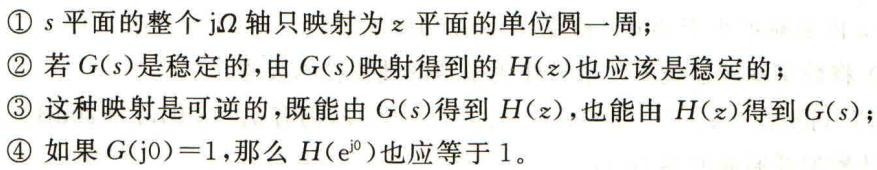

双线性z变换

满足上述4个条件的映射关系为

双线性z变换

即

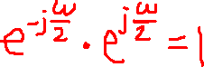

(6.5.3)

(6.5.4)

非线性关系，但是一对一的转换

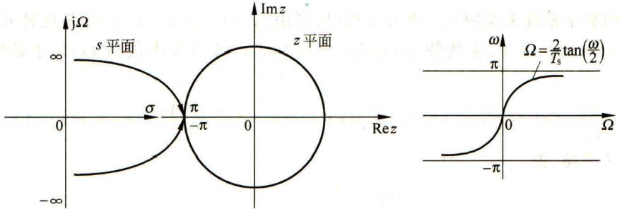

数字低通滤波器的设计步骤：

Step1.

Step2.  频率转换：

Step3.

Step4.

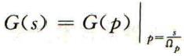

所以：

这样：系数         可以省略，因此，双线性Z变换又可定义为 ：

这一组定义和前面的定义，对最后的 DF 而言，结果是一样的，差别是中间设计的 AF， 由于缺少了频率定标

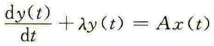

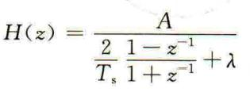

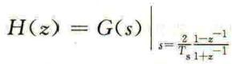

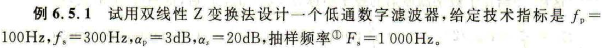

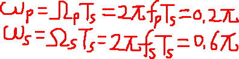

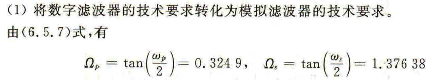

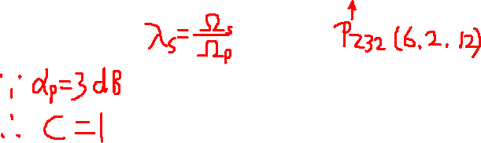

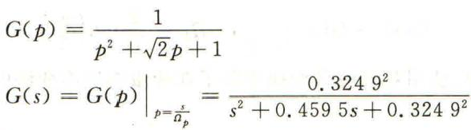

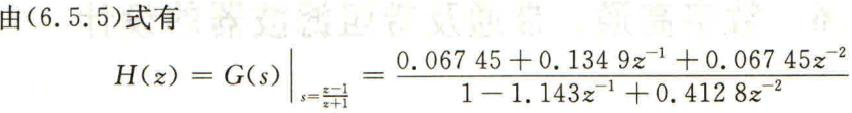

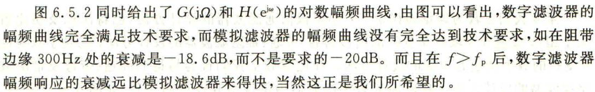

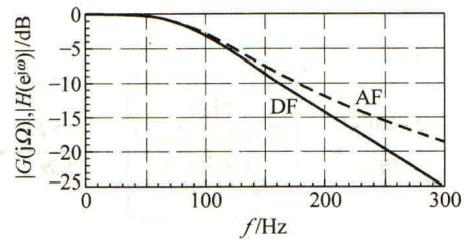

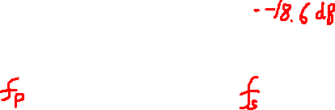

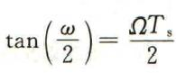

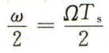

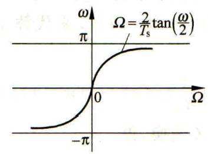

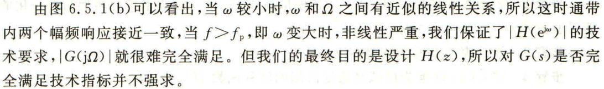

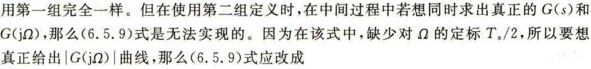

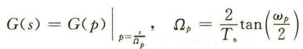

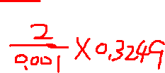

6.6 数字高通滤波器的设计

**给出**

**数字高通**

**的技术要求**

**得到**

**模拟高通**

**的技术要求**

**得到**

**模拟低通**

**的技术要求**

**最后得到**

**数字高通转移**

**函数**

**得到**

**模拟高通转移**

**函数**

**设计出**

数字高通滤波器设计步骤

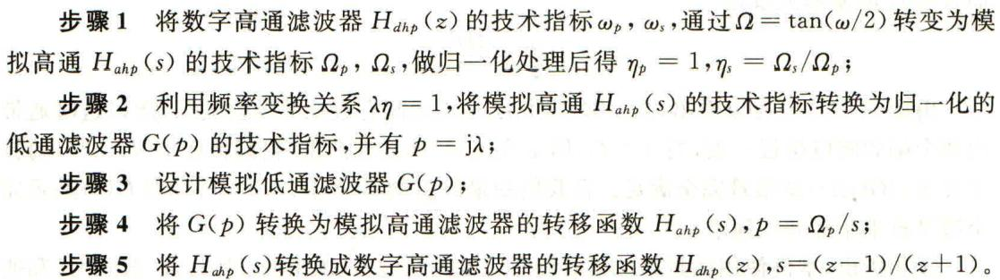

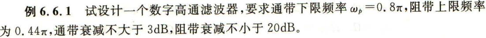

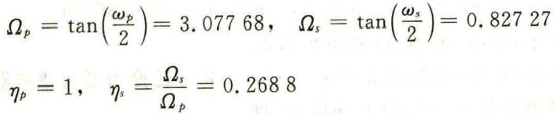

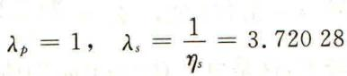

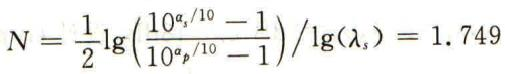

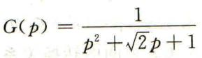

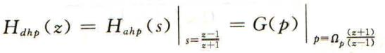

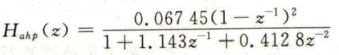