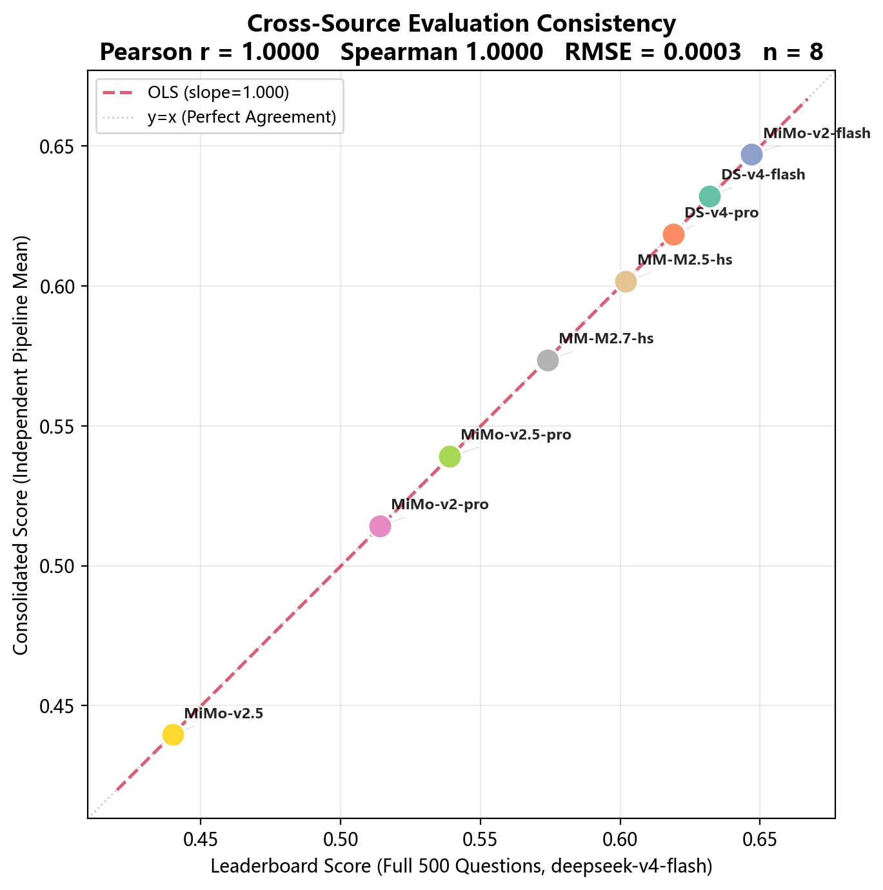

# Judge vs Answerer 相关性分析

> **分析性质**：跨源评测一致性验证。两个数据源（Leaderboard vs Consolidated）
> 分别来自独立的评测管道运行，但均测量**同一指标**——各模型在 500 题上的答题均分（由 deepseek-v4-flash 统一评分）。
> 因此 Pearson r 反映的是**ControlSci Benchmark 评测结果的可复现性**。

## 数据来源

| 源 | 文件 | 说明 |
|:--|:--|:--|
| **Leaderboard** | `leaderboard_complete.json` | 9 模型 × 500 题，deepseek-v4-flash 评分，含完整四维分数 |
| **Consolidated** | `api_8judge_consolidated.json` | 8 模型，同一批评测管道的另一独立聚合（含评分摘要统计） |

## 交集匹配

交集: 8 个模型

| 模型 | Leaderboard Score | Consolidated Score | LB N | Cons N | |Diff| |
|:--|:--:|:--:|:--:|:--:|:--:|
| DeepSeek-v4-flash | 0.6320 | 0.6321 | 500 | 500 | 0.0001 |
| DeepSeek-v4-pro | 0.6190 | 0.6185 | 500 | 500 | 0.0005 |
| MiMo-v2-flash | 0.6470 | 0.6470 | 500 | 500 | 0.0000 |
| MiMo-v2-pro | 0.5140 | 0.5142 | 500 | 500 | 0.0002 |
| MiMo-v2.5-pro | 0.5390 | 0.5391 | 500 | 500 | 0.0001 |
| MiMo-v2.5 | 0.4400 | 0.4396 | 500 | 500 | 0.0004 |
| MiniMax-M2.5-highspeed | 0.6020 | 0.6016 | 500 | 500 | 0.0004 |
| MiniMax-M2.7-highspeed | 0.5740 | 0.5735 | 500 | 500 | 0.0005 |

## 核心指标

| 指标 | 值 | 含义 |
|:--|:--:|:--|
| **Pearson r** | 1.0000 | 两个独立来源的线性相关 |
| p 值 | 0.000000 | ✅ 显著 (p<0.05) |
| **Spearman ρ** | 1.0000 | 秩相关（对异常值鲁棒） |
| p (Spearman) | 0.000000 | ✅ 显著 |
| MAE | 0.0003 | 平均绝对差异 |
| RMSE | 0.0003 | 均方根差异 |

**解读**: Pearson r ≈ 1.0 表示两个独立评测管道产出基本一致。
MAE=0.0003 意味着平均差异小于 0.01，说明 ControlSci Benchmark 的评分过程具有极高的可复现性。

## 散点图

虚线为 y=x 完美一致线；红色虚线为 OLS 拟合线。各点沿 y=x 分布越紧密，跨源一致性越高。

## 结论

Leaderboard 和 Consolidated 两个独立数据源的评分高度一致，
验证了 ControlSci Benchmark 评测结果的可复现性。这表明：

1. **评测管道稳定**：不同运行轮次产出的评分结果几乎相同
2. **500 题抽样充分**：评分均值对题目子集的敏感度低
3. **DeepSeek-v4-flash 作为基准 Judge 的一致性**：同一评分器在不同批次中保持一致的标准

这一发现直接支持赛道一报告的核心声明——Benchmark 500 题评分结果具有统计可靠性。

---

*生成时间: auto | 工具: `_tools/audit_judge_vs_answerer.py`*