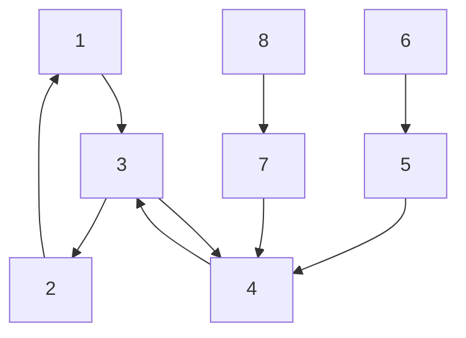

# A. Strategic sensor attack on CS-ETM

In this subsection, the effects of the strategic malicious attack on sensor on the CS-ETM is analyzed. Assume a group of 8 agents with single integrator dynamic, i.e., $A = 0$ and B = 1 in (1), communicating with an undirected graph topology depicted in Fig. 2.

flowchart

Fig. 2: The Communication Graph.

The control protocol (7) and the measurement error (3) is used. The triggering condition (6) is used with $\eta _ { 1 } = \eta _ { 2 } =$ $\eta _ { 3 } = \eta _ { 4 } = \eta _ { 5 } = \eta _ { 6 } = \eta _ { 7 } = \eta _ { 8 } = 0 . 0 1$ . The initial condition η η η η η ηof agents is assumed to be $x _ { 1 } ( 0 ) = 6 , x _ { 2 } ( 0 ) = 1 , x _ { 3 } ( 0 ) =$ $- 3 , x _ { 4 } ( 0 ) = 1 , x _ { 5 } ( 0 ) = 2 , x _ { 6 } ( 0 ) = 1 , x _ { 7 } ( 0 ) = - 2 , x _ { 8 } ( 0 ) = - 5$ . , , , , ,It is assumed that Agent 4 is under a strategic replay attack (18) for $\mathrm { t } \geq 5 . 1$ Sec. Fig. 3 shows the state of agents. Agent .4 exhibits no-triggering misbehavior and causing the original graph to cluster into 2 subgraphs, therefore harming the communication graph connectivity. These results illustrate the results of Theorem 1.

line

| Time (Sec) | x₁(t) | x₂(t) | x₃(t) | x₄(t) | x₅(t) | x₆(t) | x₇(t) | x₈(t) |
| --- | --- | --- | --- | --- | --- | --- | --- | --- |
| 0 | 6.0 | 6.0 | 6.0 | 6.0 | 6.0 | 6.0 | 6.0 | 6.0 |
| 5 | 0.0 | 0.0 | 0.0 | 0.0 | 0.0 | 0.0 | 0.0 | 0.0 |
| 10 | 0.0 | 0.0 | 0.0 | 0.0 | 0.0 | 0.0 | 0.0 | 0.0 |
| 20 | 0.0 | 0.0 | 0.0 | 0.0 | 0.0 | 0.0 | 0.0 | 0.0 |
| 30 | 0.0 | 0.0 | 0.0 | 0.0 | 0.0 | 0.0 | 0.0 | 0.0 |
| 40 | 0.0 | 0.0 | 0.0 | 0.0 | 0.0 | 0.0 | 0.0 | 0.0 |
| 50 | 0.0 | 0.0 | 0.0 | 0.0 | 0.0 | 0.0 | 0.0 | 0.0 |
| 60 | 0.0 | 0.0 | 0.0 | 0.0 | 0.0 | 0.0 | 0.0 | 0.0 |
| 70 | 0.0 | 0.0 | 0.0 | 0.0 | 0.0 | 0.0 | 0.0 | 0.0 |
| 80 | 0.0 | 0.0 | 0.0 | 0.0 | 0.0 | 0.0 | 0.0 | 0.0 |

Fig. 3: The state of agents with the CS-ETM control protocol when Agent 4 is under a strategic replay attack (18) on its sensors.
