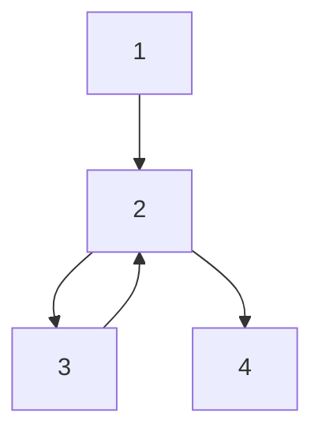

# B. Strategic actuator attack on S-ETM

In this subsection, the effects of a strategic malicious attack on the S-ETM is illustrated. Assume that there are 4 agents with single integrator dynamics, i.e., A = 0 and B = 1 in (1), communicating over the graph topology depicted in Fig. 4.

flowchart

Fig. 4: The Communication Graph.

The control protocol (10) and the measurement error (8) is used. The triggering condition (9) is used with $\eta _ { 1 } = \eta _ { 2 } =$ $\eta _ { 3 } = \eta _ { 4 } = 0 . 0 1$ η η. The initial conditions of agents are assumed η ηto be $x _ { 1 } ( 0 ) \ = \ 5 , x _ { 2 } ( 0 ) \ = \ 1 , x _ { 3 } ( 0 ) \ = \ 0 , x _ { 4 } ( 0 ) \ = \ - 2$ . Now, , , ,let Agent 2 be under a constant actuator attack with the signal $f _ { 2 } ( t ) = - 1$ for t  6 Sec. Fig. 5 and Fig. 6 show the state and the measurement error (8) for all agents. It can be seen that before the attacks all agents reach consensus and the measurement error converges to zero. This implies that the entire network reached the desired consensus value and no further triggering event is required. However, when a strategic malicious attack on the actuator of Agent 2 is launched, all agents start to diverge and the network shows a continuous-triggering misbehavior, as shown in Fig. 6. These results illustrate the results of Theorem 2.

line

| Time (Sec) | x₁(t) | x₂(t) | x₃(t) | x₄(t) |
| --- | --- | --- | --- | --- |
| 0 | 4.5 | 1.0 | 0.0 | 0.0 |
| 2 | 1.0 | 1.0 | 0.8 | 0.8 |
| 4 | 1.0 | 1.0 | 1.0 | 1.0 |
| 6 | 1.0 | 1.0 | 1.0 | 1.0 |
| 8 | 1.5 | 1.8 | 1.8 | 1.8 |
| 10 | 2.0 | 2.5 | 2.5 | 2.5 |
| 12 | 2.5 | 3.0 | 3.0 | 3.0 |
| 14 | 3.0 | 3.5 | 3.5 | 3.5 |
| 16 | 3.5 | 4.0 | 4.0 | 4.0 |
| 18 | 4.0 | 4.5 | 4.5 | 4.5 |
| 20 | 4.5 | 4.5 | 4.5 | 4.5 |

Fig. 5: The state of agents with the S-ETM control protocol when Agent 2 is under a strategic malicious attack on its actuator.

line

| Time (Sec) | e₂²(t) | e₂²(t) | e₃²(t) | e₃²(t) | e₁²(t) |
| --- | --- | --- | --- | --- | --- |
| 0 | 0.1 | 0.05 | 0.02 | 0.01 | 0.03 |
| 2 | 0.15 | 0.08 | 0.03 | 0.01 | 0.04 |
| 4 | 0.2 | 0.1 | 0.04 | 0.01 | 0.05 |
| 6 | 0.25 | 0.12 | 0.05 | 0.01 | 0.06 |
| 8 | 0.3 | 0.15 | 0.06 | 0.01 | 0.07 |
| 10 | 0.35 | 0.18 | 0.07 | 0.01 | 0.08 |
| 12 | 0.4 | 0.2 | 0.08 | 0.01 | 0.09 |
| 14 | 0.45 | 0.25 | 0.09 | 0.01 | 0.1 |
| 16 | 0.5 | 0.3 | 0.1 | 0.01 | 0.11 |
| 18 | 0.6 | 0.4 | 0.15 | 0.02 | 0.15 |
| 20 | 1.5 | 15 | 1 | 1 | 1 |

Fig. 6: The square of measurement error (8) in the S-ETM. The entire network shows continuous triggering misbehavior.
