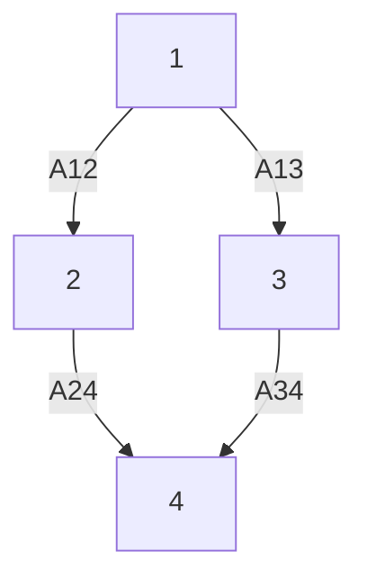

# 7. Examples

In this section, we present several examples to demonstrate the relevant results in aboves.

Example 2. As showing in Figure 1, this is a network of four nodes. The coefficient matrix of the system is selected as

$$
A = K = \left( \begin{array}{c c} 1 & 0 \\ 0 & 1 \end{array} \right), B = C = \left( \begin{array}{c c} 2 & 0 \\ 0 & 2 \end{array} \right).
$$

The weights of the selected matrix are as follows

$$
\mathcal {A} _ {1 2} = \mathcal {A} _ {1 3} = \left( \begin{array}{l l} 1 & 2 \\ 2 & 1 \end{array} \right), \mathcal {A} _ {2 4} = \mathcal {A} _ {3 4} = \left( \begin{array}{l l} 2 & 1 \\ 1 & 2 \end{array} \right).
$$


<details>
<summary>flowchart</summary>


</details>

Figure 3: The case of heterogeneous system   


<details>
<summary>flowchart</summary>

```mermaid
graph TD
    subgraph (a)
        A["1"] --> B["2"]
        A --> C["3"]
    end
    subgraph (b)
        D["1"] --> E["2"]
        D --> F["3"]
    end
    subgraph (c)
        G["1"] --> H["2"]
        G --> I["3"]
        G --> J["A12"]
        G --> K["A13"]
    end
```
</details>

Figure 4: The case of union graph which is uncontrollable


<details>
<summary>flowchart</summary>

```mermaid
graph TD
    subgraph (a)
        A1["1"] --> A2["2"]
        A1 --> A3["3"]
        A2 --> A12["A12"]
        A3 --> A13["A13"]
    end
    subgraph (b)
        B1["1"] --> C2["2"]
        C2 --> C3["3"]
        C2 -->|A23| C3
    end
    subgraph (c)
        D1["1"] --> E2["2"]
        E2 --> E3["3"]
        E2 -->|A12| D2["A12"]
        E3 -->|A13| D3["A13"]
    end
```
</details>

Figure 5: The case of subgraph including nontrival cell


<details>
<summary>flowchart</summary>


</details>

Figure 6: Observability of signed matrix weighted network

Agent 1 is chosen as the signle leader. In view of the definition, the nodes can be divided into three cells $\pi =$ {{1} , {2, 3} , {4}}. The correcponding characteristic matrix is

$$
P = \left[ \begin{array}{l l l} 1 & 0 & 0 \\ 0 & 1 & 0 \\ 0 & 1 & 0 \\ 0 & 0 & 1 \end{array} \right]
$$

then we get
