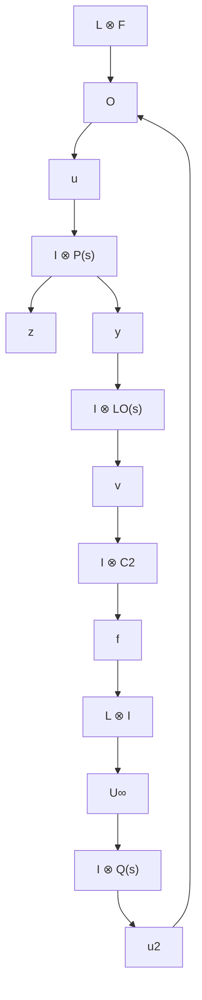

39, no.
8, pp.
1564–1574, 1994.
[31] X.
Chen and K.
Zhou, “Multiobjective H2 and $H _ { \infty }$ control design,” SIAM Journal on Control and Optimization, vol.
40, no.
2, pp.
628– 660, 2001.
[32] X.
Chen, K.
Zhou, and Y.
Tan, “Revisit of LQG control – a new paradigm with recovered robustness,” in Proceedings of the 58th IEEE Conference on Decision and Control, IEEE, 2019.
[33] Z.
Duan, J.
Zhang, C.
Zhang, and E.
Mosca, “Robust H2 and $H _ { \infty }$ filtering for uncertain linear systems,” Automatica, vol.
42, no.
11, pp.
1919–1926, 2006.
[34] J.
Jiao, H.
L.
Trentelman, and M.
K.
Camlibel, “H2 suboptimal output synchronization of heterogeneous multi-agent systems,” Systems & Control Letters, vol.
149, p.
104872, 2021.
[35] Y.
Ao and Y.
Jia, “Robust $H _ { 2 } / H _ { \infty }$ group consensus control for linear clusters over signed digraphs,” Journal of the Franklin Institute, vol.
357, no.
12, pp.
7556–7580, 2020.
[36] L.
Sheng, Z.
Wang, and L.
Zou, “Output-feedback $H _ { 2 } / H _ { \infty }$ consensus control for stochastic time-varying multi-agent systems with (x, u, v)- dependent noises,” Systems & Control Letters, vol.
107, pp.
58–67, 2017.
[37] S.
Haesaert, S.
Weiland, and C.
W.
Scherer, “A separation theorem for guaranteed H2 performance through matrix inequalities,” Automatica, vol.
96, pp.
306–313, 2018.
[38] S.
Boyd, L.
El Ghaoui, E.
Feron, and V.
Balakrishnan, Linear Matrix Inequalities in System and Control Theory.
Philadelphia, PA: SIAM, 1994.
[39] T.
Iwasaki and R.
Skelton, “All controllers for the general $H _ { \infty }$ control problem: LMI existence conditions and state space formulas,” Automatica, vol.
30, no.
8, pp.
1307–1317, 1994.
[40] Y.
Liu, Y.
Jia, J.
Du, and S.
Yuan, “Dynamic output feedback control for consensus of multi-agent systems: an H∞ approach,” in 2009 American Control Conference, pp.
4470–4475, 2009.

flowchart

