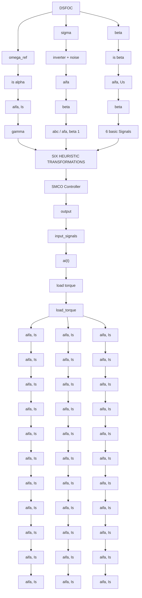

Fig 6.4 Simulation Diagram of DSFOC Induction Motor along with ASMO/C

line

| x | y1 | y2 |
| --- | --- | --- |
| 0 | 35.0 | 0.0 |
| 1 | 35.0 | 0.0 |
| 2 | 35.0 | 0.0 |
| 3 | 35.0 | 0.0 |
| 4 | -25.0 | 0.0 |
| 5 | -25.0 | 0.0 |
| 6 | -75.0 | 0.0 |
| 7 | -75.0 | 0.0 |
| 8 | -75.0 | 0.0 |
| 9 | 25.0 | 0.0 |
| 10 | -75.0 | 0.0 |
| 11 | -75.0 | 0.0 |
| 12 | -75.0 | 0.0 |
| 13 | -75.0 | 0.0 |
| 14 | -75.0 | 0.0 |
| 15 | -75.0 | 0.0 |
| 16 | -75.0 | 0.0 |
| 17 | -75.0 | 0.0 |
| 18 | -75.0 | 0.0 |
| 19 | -75.0 | 0.0 |
| 20 | -75.0 | 0.0 |
| 21 | -75.0 | 0.0 |
| 22 | -75.0 | 0.0 |
| 23 | -75.0 | 0.0 |
| 24 | -75.0 | 65.0 |
| 25 | -75.0 | 65.0 |

Fig 6.4 Simulation Results of DSFOC Actual Speed, Measured Speed and

line

| x | y1 | y2 |
| --- | --- | --- |
| 0 | 30 | 15 |
| 1 | 35 | 18 |
| 2 | 30 | 16 |
| 3 | 35 | 17 |
| 4 | 30 | 15 |
| 5 | 25 | 12 |
| 6 | 20 | 10 |
| 7 | 15 | 8 |
| 8 | 25 | 12 |
| 9 | 30 | 15 |
| 10 | 35 | 18 |
| 11 | 30 | 16 |
| 12 | 25 | 14 |
| 13 | 20 | 12 |
| 14 | 25 | 15 |
| 15 | 30 | 18 |
| 16 | 35 | 20 |
| 17 | 30 | 18 |
| 18 | 25 | 16 |
| 19 | 20 | 14 |
| 20 | 25 | 12 |
| 21 | 30 | 15 |
| 22 | 35 | 18 |
| 23 | 40 | 20 |
| 24 | 45 | 22 |
| 25 | 60 | 30 |

