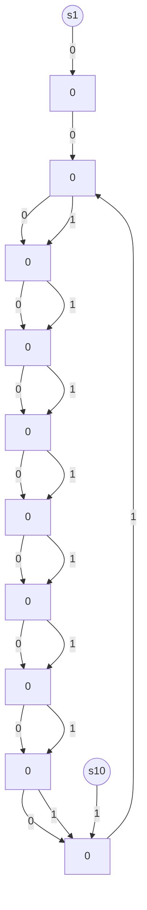

# K. Simulation Details

In this section we describe the details of the Sec. 6. Recall that since neither value functions nor value gradients are available in closed-form, we modify SoftMax PG (Algorithm 1) to make it generally implementable using a combination of (1) rollouts to estimate the value function of the current (improper) policy and (2) a stochastic approximation-based approach to estimate its value gradient.

The Softmax PG with Gradient Estimation or SPGE (Algorithm 5), and the gradient estimation algorithm 6, GradEst, are shown below.

flowchart

Figure 7: A chain MDP with 10 states.

Algorithm 5 Softmax PG with Gradient Estimation (SPGE)   
1: Input: learning rate $\eta > 0$ , perturbation parameter $\alpha > 0$ , Initial state distribution $\mu$ 2: Initialize each $\theta_m^1 = 1$ , for all $m \in [M]$ , $s_1 \sim \mu$ 3: for $t = 1$ to $T$ do
4: Choose controller $m_t \sim \pi_t$ .
5: Play action $a_t \sim K_{m_t}(s_t, :)$ .
6: Observe $s_{t+1} \sim \mathsf{P}(.|s_t, a_t)$ .
7: $\widehat{\nabla_{\theta^t} V^{\pi_\theta t}}(\mu) = \text{GradEst}(\theta_t, \alpha, \mu)$ 8: Update: $\theta^{t+1} = \theta^t + \eta. \widehat{\nabla_{\theta^t} V^{\pi_\theta t}}(\mu)$ .
9: end for

Algorithm 6 GradEst (subroutine for SPGE)   
1: Input: Policy parameters $\theta$ , parameter $\alpha > 0$ , Initial state distribution $\mu$ .
2: for $i = 1$ to #runs do
3: $u^i \sim Unif(\mathbb{S}^{M-1})$ .
4: $\theta_\alpha = \theta + \alpha.u^i$ 5: $\pi_\alpha = \text{softmax}(\theta_\alpha)$ 6: for $l = 1$ to #rollouts do
7: Generate trajectory ( $s_0, a_0, r_0, s_1, a_1, r_1, \ldots, s_{1t}, a_{1t}, r_{1t}$ )
using the policy $\pi_\alpha : \text{and } s_0 \sim \mu$ .
8: $\text{reward}^1 = \sum_{j=0}^{1t} \gamma^j r_j$ 9: end for
10: mr(i) = mean(reward)
11: end for
12: GradValue = $\frac{1}{\#runs} \sum_{i=1}^{\#runs} \text{mr}(i).u^i.\frac{M}{\alpha}$ .
13: Return: GradValue.

Next we report some extra simulations we performed under different environments.
