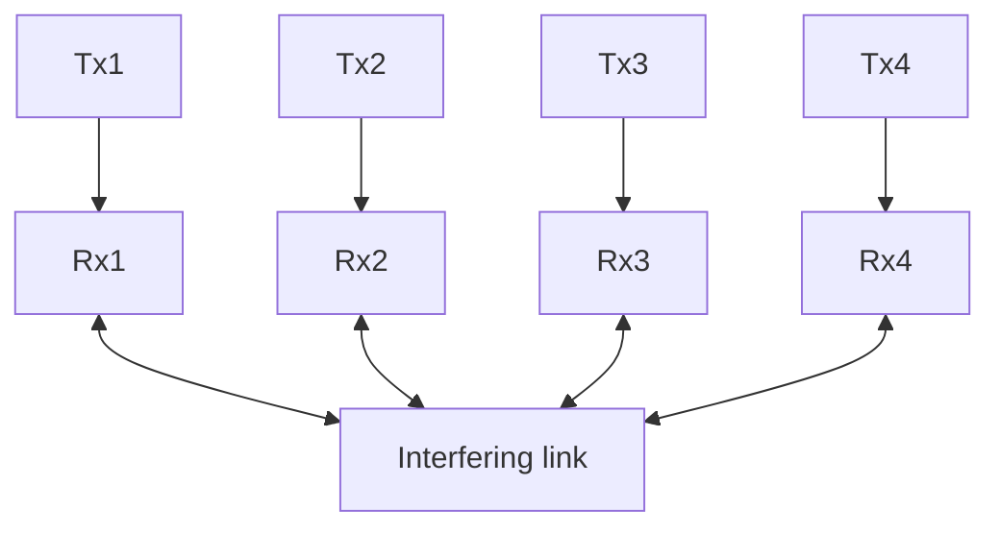

Here, we justify the value of the two policies which always follow one fixed queue, that is plotted as straight line in Figure 9(d). Let us find the value of the policy which always serves queue 1. The calculation for the other expert (serving queue 2 only) is similar. Let $q _ { i } ( t )$ denote the length of queue i at time t. We note that since the expert (policy) always recommends to serve one of the queue, the expected cost suffered in any round t is $c _ { t } = q _ { 1 } ( t ) + q _ { 2 } ( t ) = 0 + t . \lambda _ { 2 }$ . Let us start with empty queues at t = 0.


<details>
<summary>flowchart</summary>


</details>

(a) A basic path-graph interference system with N = 4 communication links.


<details>
<summary>flowchart</summary>

```mermaid
graph TD
    A["Queue 1"] --> B["●"]
    C["Queue 2"] --> D["●"]
    E["Queue 3"] --> F["●"]
    G["Queue 4"] --> H["●"]
    B <--> D
    D <--> F
    style B fill:#000,stroke:#000,color:#fff
    style D fill:#000,stroke:#000,color:#fff
    note right of D: Queues connected by edges cannot be served simultaneously
```
</details>

(b) The associated conflict (interference) graph is a pathgraph.   
Figure 10: An example of a path graph network. The interference constraints are such that physically adjacent queues cannot be served simultaneously.

$$
\begin{array}{l} V ^ {E x p e r t 1} (\underline {{\mathbf {0}}}) = \mathbb {E} \left[ \sum_ {t = 0} ^ {T} \gamma^ {t} c _ {t} \mid E x p e r t 1 \right] \\ = \sum_ {t = 0} ^ {T} \gamma^ {t}. t. \lambda_ {2} \\ \leqslant \lambda_ {2}. \frac {\gamma}{(1 - \gamma) ^ {2}}. \\ \end{array}
$$

With the values, $\gamma = 0 . 9$ and $\lambda _ { 2 } = 0 . 4 9$ , we get $V ^ { E x p e r t 1 } ( \underline { { \mathbf { 0 } } } ) \leqslant 4 4 $ , which is in good agreement with the bound shown in the figure.
