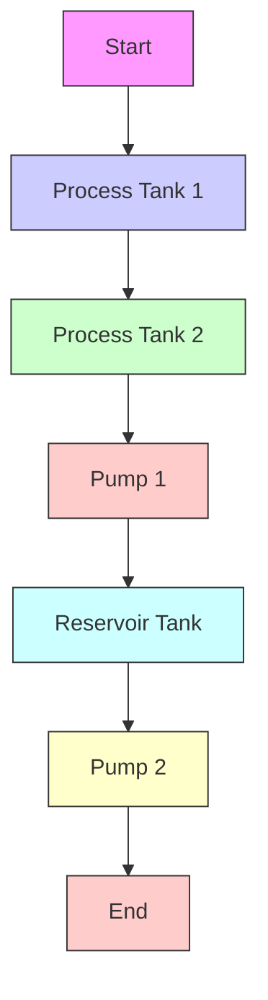

# 5.2.1 Description and Working

flowchart

Figure 5.1: Front panel diagram of conical tank system

Water from storage tank is pumped with a discharging rate of 1500 LPH, continuously to the Stainless Steel (SS) conical tank of height 700 mm through a pneumatic control valve, whose valve action is air to open type. The DPLT transmits a current signal (output range 4-20mA) with a supply range of 24V DC @ 200mA to the I/V converter. The output of the I/V converter (1-5V) is given to the PC with VDPID-03 interfacing hardware consisting of multifunction high speed ADC and DAC on either side. The onboard data converters of the VDPID-03 can be directly linked with the Simulink tool of MATLAB thus forming a complete closed loop system. The signal from the PC is transmitted to the I/P converter through V/I converter. The output from the I/P converter which operates with a constant pressure of 20 psi, is pressured air in the range of 3-15 psi for actuating the control valve, which regulates the flow of liquid into the conical tank.
