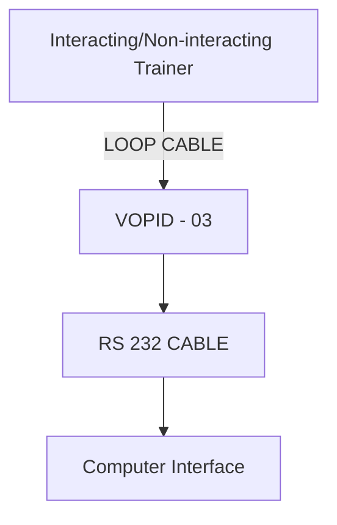

# 5.2.2 Experimental Results

In this section, the proposed controller is validated in a conical Tank system as shown in Figure 5.7. Matlab 7.10.0 / Simulink is used for experimental purpose. Initially, the process is modeled. Then, the controller is designed using proposed control design method. For modeling, the conical tank is represented as shown in Figure 5.8.

flowchart

Figure 5.7: Interfacing diagram for controlling the set point through desktop

text_image

Fin
R
r
h
H
Fout

Figure 5.8: Structure of conical tank

Conical tank model is a benchmark problem in nonlinear control systems. In this level process, conical shape of the tank with constant changing area of cross section makes the system nonlinear. The objective is to maintain the level of the liquid at a desired level, which is achieved by controlling the input flow into the tank. The controlling variable is the level of the tank and the manipulated variable is the inflow to the tank. The liquid level will flow into the tank through inlet and the liquid will come out of the tank through outlet.

Feedback control system is designed based on the actuating error signal, which is the difference between the feedback signal and the set point, is fed to the controller to bring the output to the desired value. Error is fed to the controller for the proposed PID sliding surface design, converges the error to zero in finite time. The proposed sliding surface design will force the trajectory to converge to faster than the standard sliding mode, as will be discussed in simulations section.

The structure of the conical tank system is shown in Fig. 5.8. The tank level process to be simulated is a single input single output (SISO) tank system. The user can control the inflow rate by adjusting the control signal, Fin. During the simulations, the level ‘h’ will be calculated at any instant of time, t.

Dynamic model of conical tank is given as:

Area of the conical tank is given by:
