Fig. 3: The simulation result for a multi-agent rendezvous problem given a periodic graph with 5 agents. The blue dots are the initial positions. The red stars are the desired terminal positions $\theta _ { i }$ . The lines in blue are the optimal trajectory generated by the optimal controls given $\theta _ { i }$ . The top plot in (c) is relative loss over iterations, i.e., current loss divided by the initial loss. The bottom plot in (c) is total error of parameter $\pmb \theta _ { i }$ among all agents over iterations, i.e., $\begin{array} { r l } { \sum _ { i = 1 } ^ { N } \sum _ { j = 1 } ^ { N } | |  { \dot { \theta _ { i } } } -  { \theta _ { j } } | | ^ { 2 } } & { { } } \end{array}$ .   

```mermaid
graph TD
    A["1"] --> B["2"]
    B --> C["4"]
    C --> D["5"]
    D --> E["3"]
    E --> F["1"]
    F --> G["2"]
    G --> H["4"]
    H --> I["5"]
    I --> J["3"]
    J --> K["1"]
    K --> L["2"]
    L --> M["4"]
    M --> N["5"]
    N --> O["3"]
    O --> P["1"]
    P --> Q["2"]
    Q --> R["4"]
    R --> S["5"]
    S --> T["3"]
    T --> U["1"]
    U --> V["2"]
    V --> W["4"]
    W --> X["5"]
    X --> Y["3"]
    Y --> Z["1"]
    Z --> AA["2"]
    AA --> AB["4"]
    AB --> AC["5"]
```

flowchart

Fig. 4: Periodic time variant graph $\mathbb { G } _ { k } , q = 0 , 1 , 2 , \cdots$
