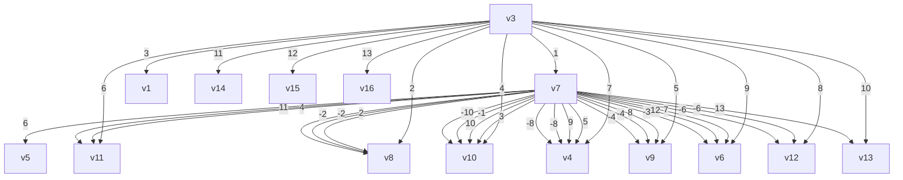

| Time (s) | x₁ | x₂ | x₃ | x₄ |
| --- | --- | --- | --- | --- |
| 0.0 | 5.0 | 3.0 | 2.0 | -4.0 |
| 0.2 | 3.0 | 3.0 | 1.5 | -3.0 |
| 0.4 | 3.0 | 3.0 | 1.0 | -3.0 |
| 0.6 | 3.0 | 3.0 | 1.0 | -3.0 |
| 0.8 | 3.0 | 3.0 | 1.0 | -3.0 |
| 1.0 | 3.0 | 3.0 | 1.0 | -3.0 |
| 1.2 | 3.0 | 3.0 | 1.0 | -3.0 |

line

| Time (s) | x₁ | x₂ | x₃ | x₄ |
| --- | --- | --- | --- | --- |
| 0.0 | 5.0 | 3.0 | -1.0 | -4.0 |
| 0.2 | 1.0 | 1.5 | -0.5 | -2.0 |
| 0.4 | 0.5 | 0.8 | 0.0 | -1.0 |
| 0.6 | 0.2 | 0.3 | 0.1 | -0.5 |
| 0.8 | 0.1 | 0.1 | 0.0 | -0.2 |
| 1.0 | 0.0 | 0.0 | 0.0 | -0.1 |
| 1.2 | 0.0 | 0.0 | 0.0 | 0.0 |

Fig. 4. State evolution of the CAN (3) under the signed digraphs of Figure 3. (a) Under Figure 3 (a). (b) Under Figure 3(b).

line

| Time (s) | ξ₁ | ξ₂ | ξ₃ | ξ₄ | ξ₅ |
| --- | --- | --- | --- | --- | --- |
| 0 | -10.0 | 8.0 | 1.0 | -4.0 | -8.0 |
| 0.5 | 0.0 | 0.0 | 0.0 | 0.0 | 0.0 |
| 1.0 | 0.0 | 0.0 | 0.0 | 0.0 | 0.0 |
| 1.5 | 0.0 | 0.0 | 0.0 | 0.0 | 0.0 |
| 2.0 | 0.0 | 0.0 | 0.0 | 0.0 | 0.0 |

line

| Time (s) | s1 | s2 | s3 | s4 | s5 |
| --- | --- | --- | --- | --- | --- |
| 0 | -10 | 8 | -6 | -4 | 6 |
| 0.5 | 0 | 0 | 0 | 0 | 0 |
| 1.0 | 0 | 0 | 0 | 0 | 0 |
| 1.5 | 0 | 0 | 0 | 0 | 0 |
| 2.0 | 0 | 0 | 0 | 0 | 0 |

Fig. 7. Evolution of the sliding variables under the signed digraphs of Figure 1. (a) Under Figure 1 (a). (b) Under Figure 1 (b)

flowchart

flowchart

