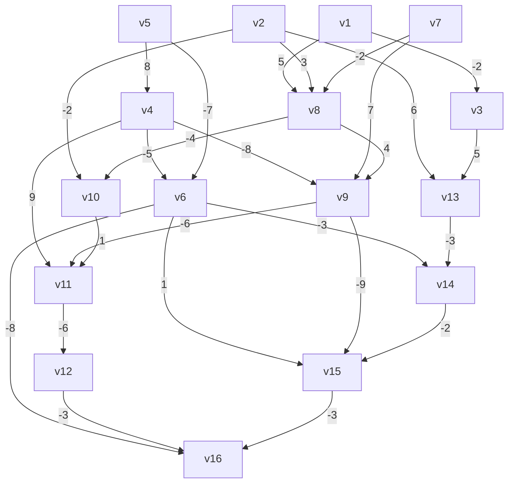

Fig. 5. Two weakly connected signed digraphs.

line

| Time (s) | z1 | z2 | z3 | z4 | z5 |
| --- | --- | --- | --- | --- | --- |
| 0.0 | 5.0 | 3.0 | 2.0 | 1.0 | 0.0 |
| 0.5 | 3.0 | 1.0 | 0.0 | -1.0 | -2.0 |
| 1.0 | 1.0 | 0.0 | -1.0 | -2.0 | -3.0 |
| 1.5 | 0.0 | 0.0 | -2.0 | -3.0 | -4.0 |
| 2.0 | 0.0 | 0.0 | -3.0 | -4.0 | -5.0 |

(a)

line

| Time (s) | z₁ | z₂ | z₃ | z₄ | z₅ |
| --- | --- | --- | --- | --- | --- |
| 0.0 | 5.0 | 3.0 | 1.0 | -2.0 | -4.0 |
| 0.5 | 3.5 | 1.5 | 0.5 | -1.5 | -3.0 |
| 1.0 | 1.0 | 0.5 | 0.0 | -0.5 | -1.0 |
| 1.5 | 0.5 | 0.0 | -0.5 | -0.5 | -0.5 |
| 2.0 | 0.5 | 0.0 | -0.5 | -0.5 | -0.5 |

(b)   
Fig. 8. State evolution of the CAN(2) under the signed digraphs of Figure 1. (a) Under Figure 1 (a). (b) Under Figure 1 (b)

Example 4. Let us consider the CAN (2) with $\begin{array} { r l } { d _ { k } } & { { } = } \end{array}$ sin $\left( 2 k t + { \frac { \pi } { 3 } } \right)$ under the same signed digraphs as considered in Example 1. Since $| d _ { k } | \le 1$ , we can choose $\mu _ { 1 } = 1 . 2 $ . The other control parameters in (46) and (47) are chosen as κ = $2 , T _ { r } = 0 . 5 , T _ { s } = 1 , \rho _ { 1 } = 0 . 1 , \rho _ { 2 } = 0 . 3 , \mu _ { 2 } = 0 . 6 , \mu _ { 3 } = 0 . 9$ . In the simulations, we set $X \left( 0 \right) = \left[ - 4 , 3 , - 1 , 2 , - 2 , 5 \right] ^ { \mathrm { T } }$ and $\sigma \left( 0 \right) = \left[ - 9 , 1 , - 5 , 8 , - 4 , 6 \right] ^ { \mathrm { T } }$ . Figures 7 and 8, respectively, show the evolution of the sliding variables and the agents’ states under the signed digraphs of Figure 1. From Figure 7, we see that the sliding variables converge to zero within the predefined finite time $T _ { r } = 0 . 5$ . From Figure 8, we see that the CAN (2) reaches stability and bipartite consensus in the predefined finite time $T _ { r } { + } T _ { s } = 1 . 5$ under the signed digraphs of Figure 1(a) and (b), respectively. This demonstrates the results of Theorem 4.
