```mermaid
graph TD
    A[" "] --> B["min"]
    B --> C[" "]
    B --> D["min"]
    C --> E[" "]
    D --> F[" "]
    E --> G["min"]
    F --> H["min"]
    G --> I["a1 a2 a3 a4 a5 a6 a7"]
    H --> J["a7"]
    style A fill:#fff,stroke:#000
    style B fill:#fff,stroke:#000
    style C fill:#fff,stroke:#000
    style D fill:#fff,stroke:#000
    style E fill:#fff,stroke:#000
    style F fill:#fff,stroke:#000
    style G fill:#fff,stroke:#000
    style H fill:#fff,stroke:#000
    style I fill:#fff,stroke:#000
    style J fill:#fff,stroke:#000
    subgraph ReLU Layer
        direction TB
        A -.-> B
        B -.-> C
        C -.-> D
        D -.-> E
        E -.-> F
        F -.-> G
        G -.-> H
        H -.-> I
        I -.-> J
        J -.-> K
        K -.-> L
        L -.-> M
        M -.-> N
        N -.-> O
        O -.-> P
        P -.-> Q
        Q -.-> R
        R -.-> S
        S -.-> T
        T -.-> U
        U -.-> V
        V -.-> W
        W -.-> X
        X -.-> Y
        Y -.-> Z
        Z -.-> AA
        AA -.-> AB
        AB -.-> AC
        AC -.-> AD
        AD -.-> AE
        AE -.-> AF
        AF -.-> AG
        AG -.-> AH
        AH -.-> AI
        AI -.-> AJ
        AJ -.-> AK
        AK -.-> AL
        AL -.-> AM
        AM -.-> AN
        AN -.-> AO
        AO -.-> AP
        AP -.-> AQ
        AQ -.-> AR
        AR -.-> AS
        AS -.-> AT
        AT -.-> AU
        AU -.-> AV
        AV -.-> AW
        AW -.-> AX
        AX -.-> AY
        AY -.-> AZ
        AZ -.-> BA
        BA -.-> BB
        BB -.-> BC
        BC -.-> BD
        BD -.-> BE
        BE -.-> BF
        BF -.-> BG
        BG -.-> BH
        BH -.-> BI
        BI -.-> BJ
        BJ -.-> BK
        BK -.-> BL
        BL -.-> BM
        BM -.-> BN
        BN -.-> BO
        BO -.-> BP
        BP -.-> BQ
        BQ -.-> BR
        BR -.-> BS
        BS -.-> BT
        BT --> CA["a1 a2 a3 a4 a5 a6 a7"]
    end
```

# A.2 Lipschitz Constant Analysis for TNN

Upper bound for local Lipschitz constant of a FFNN is derived in [18], [15]. The presence of linear activation functions in STL2NN must not impose computational complexity but if we include them in the proposed procedure in [18], [15] the optimization process faces memory problems as the size of LMI increases unnecessarily. Thus we slightly modify the proposed solution. We call this slightly modified version as Trapezium−Lip−SDP(). Here we propose a summary of the convex programming approach from [18], [15] including the slight changes we apply on it.

Let’s define the SDP variable $\rho ~ = ~ \rho _ { 1 } ^ { 2 }$ . We can reformulate the Lipschitz inequality $\| f ( x _ { 1 } ) - f ( x _ { 2 } ) \| _ { 2 } \leq \sqrt { \rho } \| x _ { 1 } - x _ { 2 } \| _ { 2 }$ in the form of linear quadratic constraint as follows:

$$
\left[ \begin{array}{c} x _ {1} - x _ {2} \\ f (x _ {1}) - f (x _ {2}) \end{array} \right] ^ {\top} \left[ \begin{array}{c c} \rho I _ {n} & 0 _ {n \times 1} \\ 0 _ {1 \times n} & - 1 \end{array} \right] \left[ \begin{array}{c} x _ {1} - x _ {2} \\ f (x _ {1}) - f (x _ {2}) \end{array} \right] \geq 0
$$

flowchart

