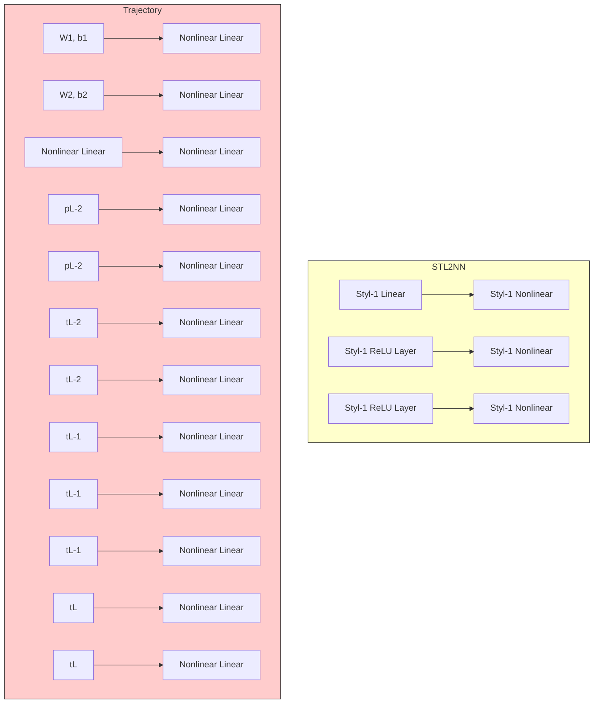

$$
\delta Z ^ {\top} \left(\sum_ {\ell = 1} ^ {N} E _ {\ell} ^ {\top} Q _ {\ell} E _ {\ell} - T ^ {\top} \left[ \begin{array}{c c} \rho I _ {n} & 0 _ {n \times 1} \\ 0 _ {1 \times n} & - 1 \end{array} \right] T\right) \delta Z \leq 0 \tag {23}
$$

and proposing $\begin{array} { r } { Q _ { \mathrm { i n f o } } = \sum _ { \ell = 1 } ^ { N } E _ { \ell } ^ { \top } Q _ { \ell } E _ { \ell } } \end{array}$ a sufficient condition to satisfy (23) is,

$$
Q _ {\mathrm{info}} - T ^ {\top} \left[ \begin{array}{c c} \rho I _ {n} & 0 _ {n \times 1} \\ 0 _ {1 \times n} & - 1 \end{array} \right] T \leq 0
$$

flowchart

Fig. 11: Shows the TNN structure. Here N is the number of layers on TNN. $[ t _ { \ell } , z _ { \ell } ] ^ { \top }$ presents the activation vector for \`-th layer and $[ t _ { \ell } , p _ { \ell } ] ^ { \top }$ presents its pre-activation on TNN. The role of a linear activation function is to copy its input

bar

