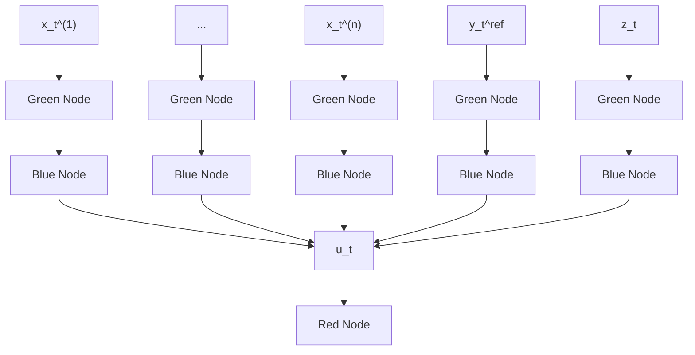

# B. Modular Neural Network

As described in Section VI, the $g _ { \boldsymbol { \theta } }$ of PIME-PPO is a modular neural network with separate networks for the integrated error $z _ { t }$ and the other items $x _ { t }$ and $y _ { t } ^ { \mathrm { r e f } } .$ , see Figure 7.

flowchart

Fig. 7: Network architecture of $g _ { \boldsymbol { \theta } }$ in PIME-PPO. Bias and activation functions are ignored.
