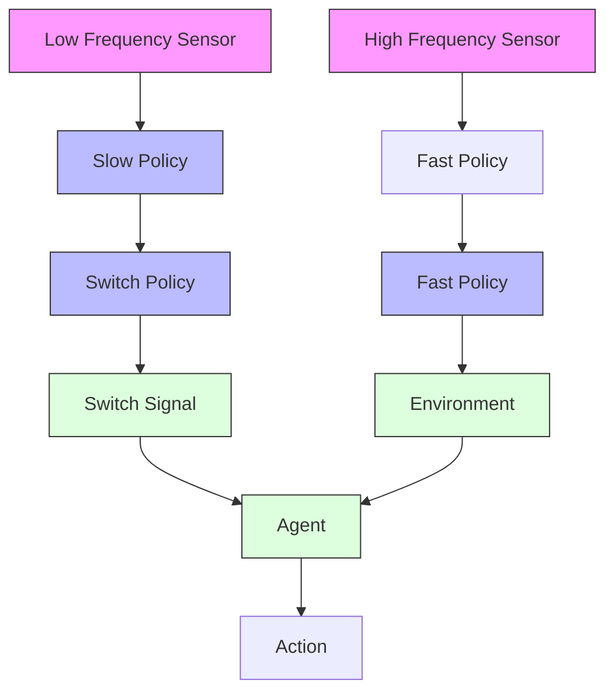

# TLA Architecture

Here we provide a figure with more detailed architecture of TLA.

flowchart

Figure 9: The TLA architecture has two different layers: Slow (Blue) and Fast (Red). It has three different RL agents that are trained in parallel: Slow, Fast, and Switch. Each network receives a different reward penalty resulting in the optimization of energy in addition to the performance.
