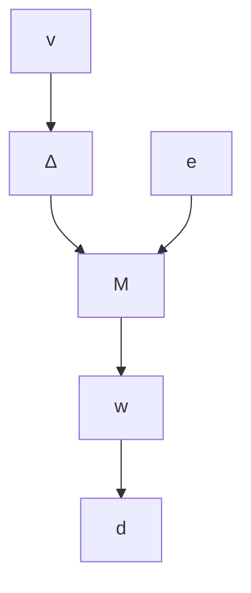

# C. Robust Performance

This section summarizes existing results on robust performance. These are special cases of results for the structured singular value, $\mu .$ . Details, including more general results, can be found in [33] or Chapter 11 of [1]. All systems in this appendix are assumed to be causal.

Consider the uncertain interconnection shown in Figure 15. The interconnection, denoted $F _ { U } ( M , \Delta )$ , consists of an uncertainty $\Delta$ around the upper channels of a M . We will initially consider the case where $w \in \mathbb { C } ^ { n _ { w } } , \ d \in \mathbb { C } ^ { n _ { d } } , \ v \in \mathbb { C } ^ { n _ { v } }$ , and $e \in \mathbb { C } ^ { n _ { e } }$ are complex vectors. Moreover, $M \in \mathbb { C } ^ { ( n _ { v } + n _ { e } ) \times ( n _ { w } + n _ { d } ) }$ and the uncertainty $\Delta \in \mathbb { C } ^ { n _ { w } \times n _ { v } }$ are complex matrices. The interconnection in Figure 15 corresponds to the following algebraic equations:

$$
\left[ \begin{array}{l} v \\ e \end{array} \right] = \left[ \begin{array}{l l} M _ {1 1} & M _ {1 2} \\ M _ {2 1} & M _ {2 2} \end{array} \right] \left[ \begin{array}{l} w \\ d \end{array} \right] \tag {47}
w = \Delta v,$$

where the matrix M has been block partitioned conformably with the input/output signals.

The matrix interconnection $F _ { U } ( M , \Delta )$ is said to be well-posed if $I _ { n { v } } - M _ { 1 1 } \Delta$ is nonsingular. If the interconnection is well posed then for each $d \in \mathbb { C } ^ { n _ { d } }$ there exist unique $( v , e , w )$ that satisfy

flowchart

Fig. 15. Uncertain interconnection $F _ { U } ( M , \Delta )$ .

(47). Moreover, the output e is given by:

$$e = [ \underbrace {M _ {2 2} + M _ {2 1} \Delta (I _ {n _ {v}} - M _ {1 1} \Delta) ^ {- 1} M _ {1 2}} _ {:= F _ {U} (M, \Delta)} ] d.$$

The first main result concerns the well-posedness and gain of $F _ { U } ( M , \Delta )$ when the uncertainty satisfies $\bar { \sigma } ( \Delta ) \leq 1$ . The proof uses the equivalence of $\| \cdot \| _ { 2 \to 2 }$ and $\bar { \sigma } ( \cdot )$ for matrices.

Lemma 6. Let $M \in \mathbb { C } ^ { ( n _ { v } + n _ { e } ) \times ( n _ { w } + n _ { d } ) }$ be given. The following are equivalent:

A) There exists $D \in \mathbb { R }$ with $D > 0$ such that:
