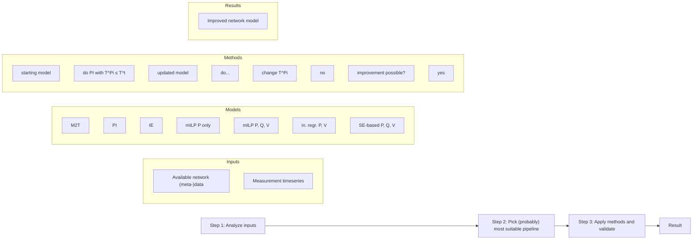

# VISION AND FUTURE WORK

We believe essentially all of the data issues can be overcome, and that they do not need to be a major hurdle in the deployment of better physics-driven support tools in the real world. Nevertheless, bringing the deployment costs down further through novel methods is a major research opportunity. Therefore, Fig. 3 sketches a system identification/network data cleaning framework to improve existing DN models that represents the authors’ vision. Different calibration tasks are sequentially applied: meter-to-transformer (M2T) assignment, phase identification (PI), etc., forming the pipelines (Step 2). Given the wide variety of DN features (unbalance level, number of users, etc.), utilities would benefit from toolboxes that have different methods for each task. A robust framework makes an informed guess on which methods are preferred in a given context (analyzing inputs, Step 1). Features that affect the accuracy of a method need to be investigated: e.g., voltage clustering might not work well for PI in rather balanced DNs, whereas methods that can exploit both power and voltage measurements may be accurate. Similarly, the NYSERDA report [15] highlights that in the identification and calibration of SE input errors, the error type is assumed to be known, and bad data have been removed a priori. The impact of bad data on system identification processes is underaddressed. Furthermore, data from during outages can be exploited to identify topology and phase inaccuracies.

flowchart

Fig. 3: Sequential, validated and automated data cleaning framework. (MILP: mixed-integer linear programming.)
