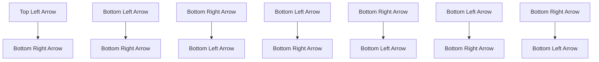
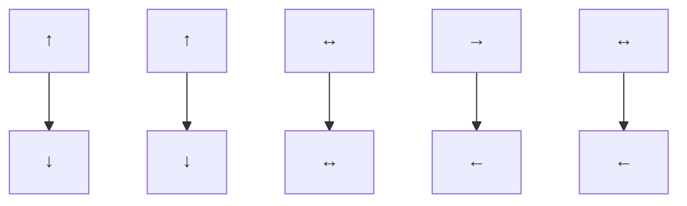

bar

| Category | Value |
| --- | --- |
| 1 | 0.5 |
| 2 | 0.3 |
| 3 | 0.6 |
| 4 | 0.4 |
| 5 | 0.7 |
| 6 | 0.8 |
| 7 | 1.0 |
| 8 | 1.1 |
| 9 | 1.2 |
| 10 | 1.3 |
| 11 | 1.4 |
| 12 | 1.5 |
| 13 | 1.6 |
| 14 | 1.7 |
| 15 | 1.8 |
| 16 | 1.9 |
| 17 | 2.0 |
| 18 | 2.1 |
| 19 | 2.2 |
| 20 | 2.3 |

bar

| time | flow ratio |
| --- | --- |
| 0 | 0.2 |
| 500 | 0.2 |
| 1000 | 0.3 |
| 1500 | 0.6 |
| 2000 | 0.8 |
| 2500 | 1.0 |
| 3000 | 0.9 |
| 3500 | 0.4 |
| 3750 | 0.3 |

bar

| time | Value |
| --- | --- |
| 0 | 1.0 |
| 500 | 1.2 |
| 1000 | 1.1 |
| 1500 | 1.1 |
| 2000 | 0.8 |
| 2500 | 0.3 |
| 3000 | 0.6 |
| 3500 | 0.5 |

Figure B.1 Four types of flow distribution

Table B.1 The layout and potential signal phases of intersections in the network

<table><tr><td>Type</td><td>Layout</td><td>Phase pattern</td></tr><tr><td>1</td><td></td><td></td></tr></table>

2   

flowchart

natural_image

Four abstract geometric shapes with arrow symbols, no text or labels present

flowchart

Table B.2 Traffic demand
