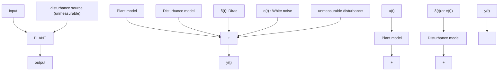

In “adaptive regulation” the objective is to asymptotically suppress the effect of unknown and time-varying disturbances. Therefore adaptive regulation focuses on adaptation of the controller parameters with respect to variations of parameters of the disturbance model. The plant model is assumed to be known. It is also assumed that the possible small variations of the plant model can be handled by a robust control design. The important remarks to be made are:

flowchart

Fig. 14.1 Plant model and disturbance model

• No effort is made to estimate the model of the plant in real time.   
• Indirect (correlated) measurement of the disturbance is not available.

To be more specific, in adaptive regulation the disturbances considered can be defined as “finite band disturbances”. This includes single or multiple narrow-band disturbances or sinusoidal disturbances. Furthermore for robustness reasons the disturbances should be located in the frequency domain within the regions where the plant has enough gain (see explanation in Sect. 14.3).

If an image of the disturbance (i.e., a correlated measurement) can be obtained using a well located additional transducer, a feedforward compensation scheme can be considered. This will be discussed in Chap. 15. Feedforward compensation can be used in addition to a feedback approach.
