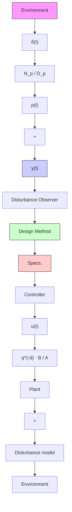

```mermaid
graph TD
    A["Environment"] --> B["δ(t)"]
    B --> C["N_p / D_p"]
    C --> D["p(t)"]
    D --> E["+"]
    E --> F["y(t)"]
    F --> G["Disturbance Observer"]
    G --> H["Design Method"]
    H --> I["Specs."]
    I --> J["Controller"]
    J --> K["u(t)"]
    K --> L["q^{-d} · B / A"]
    L --> M["Plant"]
    M --> N["+"]
    N --> O["Disturbance model"]
    O --> P["Environment"]
    style A fill:#f9f,stroke:#333
    style F fill:#ccf,stroke:#333
    style H fill:#cfc,stroke:#333
    style I fill:#fcc,stroke:#333
```

flowchart

```mermaid
graph TD
    A["Controller"] --> B["1 / S₀"]
    B --> C["u(t)"]
    C --> D["Plant q⁻ᵈB / A"]
    D --> E["+"]
    E --> F["y(t)"]
    F --> G["Adaptation Algorithm"]
    G --> H["R₀"]
    H --> I["Q̂"]
    I --> J["Model q⁻ᵈB"]
    J --> K["+"]
    K --> L["Model A"]
    L --> M["+"]
    M --> N["p(t)"]
    N --> O["Nₚ / Dₚ"]
    O --> P["d(t)"]
    P --> Q["+"]
    Q --> R["y(t)"]
    R --> S["Adaptation Algorithm"]
    S --> T["w(t)"]
    T --> U["Model q⁻ᵈB"]
    U --> V["+"]
    V --> W["Model A"]
    W --> X["+"]
    X --> Y["y(t)"]
    Y --> Z["Adaptation Algorithm"]
    Z --> AA["R₀"]
    AA --> AB["+"]
    AB --> AC["Model q⁻ᵈB / A"]
    AC --> AD["+"]
    AD --> AE["Model A"]
    AE --> AF["y(t)"]
    AF --> AG["Adaptation Algorithm"]
    AG --> AH["R₀"]
    AH --> AI["+"]
    AI --> AJ["Model q⁻ᵈB / A"]
    AJ --> AK["+"]
    AK --> AL["Model A"]
    AL --> AM["y(t)"]
    AM --> AN["Adaptation Algorithm"]
    AN --> AO["R₀"]
    AO --> AP["+"]
    AP --> AQ["Model q⁻ᵈB / A"]
    AQ --> AR["+"]
    AR --> AS["Model A"]
    AS --> AT["y(t)"]
    AT --> AU["Adaptation Algorithm"]
    AU --> AV["R₀"]
    AV --> AW["+"]
    AW --> AX["Model q⁻ᵈB / A"]
    AX --> AY["+"]
    AY --> AZ["Model A"]
    AZ --> BA["y(t)"]
    BA --> BB["Adaptation Algorithm"]
    BB --> BC["R₀"]
    BC --> BD["+"]
    BD --> BE["Model q⁻ᵈB / A"]
    BE --> BF["+"]
    BF --> BG["Model A"]
    BG --> BH["y(t)"]
    BH --> BI["Adaptation Algorithm"]
    BI --> BJ["R₀"]
    BJ --> BK["+"]
    BK --> BL["Model q⁻ᵈB / A"]
    BL --> BM["+"]
    BM --> BN["Model A"]
    BN --> BO["y(t)"]
    BO --> BP["Adaptation Algorithm"]
    BP --> BQ["R₀"]
    BQ --> BR["+"]
    BR --> BS["Model q⁻ᵈB / A"]
    BS --> BT["+"]
    BT --> BU["Model A"]
    BU --> BV["y(t)"]
    BV --> BW["Adaptation Algorithm"]
    BW --> BX["R₀"]
    BX --> BY["+"]
    BY --> BZ["Model q⁻ᵈB / A"]
    BZ --> CA["+"]
    CA --> CB["Model A"]
    CB --> CC["y(t)"]
    CC --> CD["Adaptation Algorithm"]
    CD --> CE["R₀"]
```

Fig. 14.3 Direct adaptive control scheme for rejection of unknown disturbances
