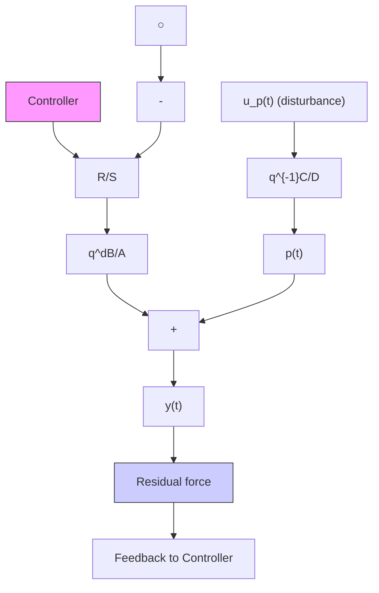

# 14.7.2 Experimental Results

The performance of the system for rejecting multiple unknown time-varying narrow band disturbances will be illustrated using the direct adaptive regulation scheme presented in Sect. 14.4. A comparison between direct and indirect regulation strategies will also be provided.8

text_image

machine
primary force (disturbance)
elastomere cone
residual force
inertial actuator
steel housing
coil winding
elastic link
mobile part (magnet)
support
power amplifier
controller

Fig. 14.4 Active vibration control using an inertial actuator (scheme)   
Fig. 14.5 Block diagram of the active vibration control system

flowchart

