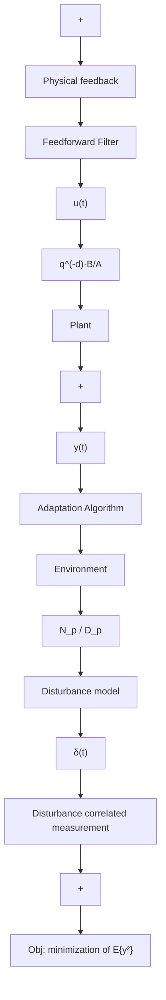

The system consists of three mobile metallic plates (M1, M2, M3) connected by springs. The first and the third plates are also connected by springs to the rigid part of the system formed by two other metallic plates, themselves connected rigidly. The upper and lower mobile plates (M1 and M3) are equipped with inertial actuators. The one on the top serves as disturbance generator (see Fig. 15.2), the one at the bottom serves for disturbance compensation. The system is equipped with a measure of the residual acceleration (on plate M3) and a measure of the image of the disturbance made by an accelerometer posed on plate M1. The path between the disturbance (in this case, generated by the inertial actuator on top of the structure), and the residual acceleration is called the global primary path, the path between the measure of the image of the disturbance and the residual acceleration (in open loop) is called the primary path and the path between the inertial actuator and the residual acceleration is called the secondary path. When the compensator system is active, the actuator acts upon the residual acceleration, but also upon the measurement of the image of the disturbance (a positive feedback). The measured quantity u(t)ˆ will be the sum of the correlated disturbance measurement and of the effect of the actuator used for compensation.

flowchart

Fig. 15.1 Adaptive feedforward compensation of unknown disturbances

flowchart

