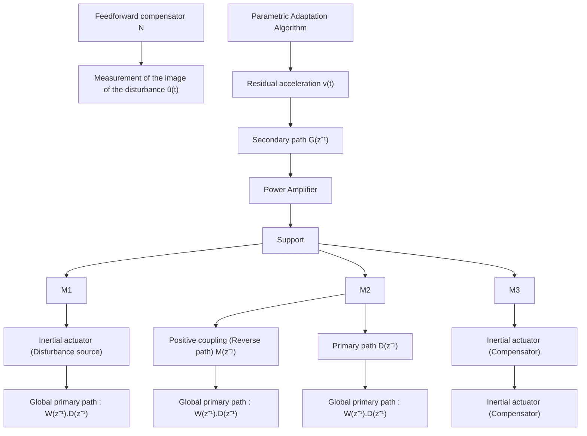
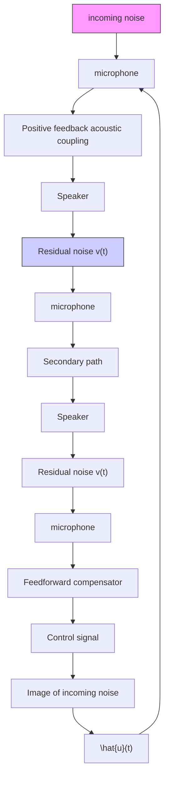

Fig. 15.2 An AVC system using a feedforward compensation-scheme

flowchart

Fig. 15.3 An ANC system using a feedforward compensation-scheme

Similar structures also occur in feedforward ANC (Jacobson et al. 2001; Zeng and de Callafon 2006). This is illustrated in Fig. 15.3 which represents an ANC system used to reduce noise in an airduct. It uses a loudspeaker as an actuator for noise reduction. However, since the loudspeaker will generate waves both down stream and upstream, this will influence the measurement of the image of the disturbance creating an acoustic positive feedback coupling.
