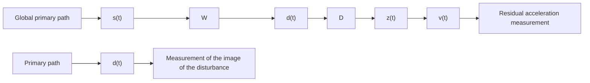

The corresponding block diagrams in open-loop operation and with the compensator system are shown in Fig. 15.4. The signal $d ( t )$ is the image of the disturbance measured when the compensator system is not used (open loop). The signal u(t) ˆ denotes the effective output provided by the measurement device when the compensator system is active and which will serve as input to the adaptive feedforward filter $\hat { N }$ . The output of this filter denoted by $- \hat { y } ( t )$ is applied to the actuator through an amplifier. The transfer function $G$ (the secondary path) characterizes the dynamics from the output of the filter $\hat { N }$ to the residual acceleration measurement (amplifier + actuator + dynamics of the mechanical system). Subsequently we will call the transfer function between d(t) and the measurement of the residual acceleration the “primary path”.

The coupling between the output of the feedforward filter compensator and the measurement u(t) ˆ through the compensator actuator is denoted by M. As indicated in Fig. 15.4, this coupling is a “positive” feedback. The positive feedback may destabilize the system.1 The system is no longer a pure feedforward compensator. In many cases, this unwanted coupling raises problems in practice and makes the analysis of adaptive (estimation) algorithms more difficult. The problem is to estimate and adapt the parameters of the feedforward filter in the presence of this internal positive feedback.

It is important to make the following remarks, when the feedforward filter is absent (open-loop operation):

flowchart

flowchart

