```mermaid
graph TD
    A["s(t)"] --> B["W"]
    B --> C["d(t)"]
    C --> D["D"]
    D --> E["z(t)"]
    E --> F["Residual acceleration measurement"]
    F --> G["+"]
    G --> H["v^0(t)"]
    H --> I["Parameter Adaptation Algorithm"]
    I --> J["PAA"]
    J --> K["Feedforward filter"]
    K --> L["+"]
    L --> M["+"]
    M --> N["+"]
    N --> O["+"]
    O --> P["+"]
    P --> Q["+"]
    Q --> R["+"]
    R --> S["+"]
    S --> T["+"]
    T --> U["+"]
    U --> V["+"]
    V --> W["+"]
    W --> X["+"]
    X --> Y["+"]
    Y --> Z["+"]
    Z --> A
    style A fill:#f9f,stroke:#333
    style B fill:#ccf,stroke:#333
    style C fill:#cfc,stroke:#333
    style D fill:#fcc,stroke:#333
    style E fill:#cff,stroke:#333
    style F fill:#ffc,stroke:#333
    style G fill:#fcf,stroke:#333
    style H fill:#cff,stroke:#333
    style I fill:#ffc,stroke:#333
    style J fill:#cfc,stroke:#333
    style K fill:#fcc,stroke:#333
    style L fill:#ffc,stroke:#333
    style M fill:#fcc,stroke:#333
    style N fill:#ffc,stroke:#333
    style O fill:#fcc,stroke:#333
    style P fill:#ffc,stroke:#333
    style Q fill:#fcc,stroke:#333
    style R fill:#ffc,stroke:#333
    style S fill:#fcc,stroke:#333
    style T fill:#ffc,stroke:#333
    style U fill:#fcc,stroke:#333
```

(b)   
Fig. 15.4 Feedforward AVC: in open loop (a) and with adaptive feedforward compensator (b)

1. One can identify very reliable models for the secondary path and the “positive” feedback path by applying appropriate excitation on the actuator (for example PRBS).   
2. One can get an estimation of the primary path transfer function from the spectral densities of $d ( t )$ and ν(t ) (the actuator being at rest).

It is also important to note that the estimation of the feedforward filter in Fig. 15.4 can be interpreted as an identification-in-closed-loop operation (see Chap. 9 and Landau and Karimi 1997b) or as estimation in closed loop of a (reduced order) controller as in Landau et al. (2001b). Therefore, to a certain extent, the results given in Chap. 9 and Landau et al. (2001b) can be used to this problem.
