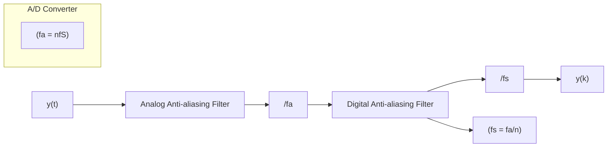

# 16.2.1 Selection of the Sampling Frequency

A good rule for the selection of the sampling frequency is:

$$f _ {s} = (6 \rightarrow 2 5) f _ {B} ^ {C L} \tag {16.1}$$

where:

• $f _ { s } =$ sampling frequency (in Hz);   
• $f _ { B } ^ { C L }$ = desired bandwidth of the closed-loop system (in Hz).

Of course, the desired closed-loop bandwidth is related to the bandwidth of the system to be controlled. The formula (16.1) gives enough freedom for the selection of the sampling frequency.

It is important to recall that many systems have a pure time delay or their behavior can be approximated by a time delay plus dynamics. One has the following relationship between continuous-time delay and discrete-time delay:

$$\tau = d T _ {s} + L; \quad 0 < L < T _ {s} \tag {16.2}$$

where:

• $\tau =$ time delay of the continuous-time system;   
• $T _ { s }$ = sampling period $( T _ { s } = 1 / f _ { s } ) ;$   
• d = integer discrete-time delay;   
• L = fractional delay.

Except in very particular cases, all the discrete-time models will feature a fractional delay. Fractional delays are reflected as zeros in the transfer function of the discretetime models. For simple continuous-time models (like first order plus delay), the zeros induced by the fractional delay become unstable for $L \ge 0 . 5 T _ { s }$ (Landau 1990b; Landau and Zito 2005; Franklin et al. 1990). Therefore, the selection of the sampling frequency becomes crucial if we would like to use control laws which cancel the system zeros (tracking and regulation with independent objectives, minimum variance tracking and regulation). For continuous-time systems with a relative degree higher or equal to 2, high-frequency sampling will induce unstable zeros (Åström et al. 1984). As a general rule, one tries to select the lower sampling frequency compatible with the desired performances.

Fig. 16.1 Data acquisition with oversampling   

flowchart

