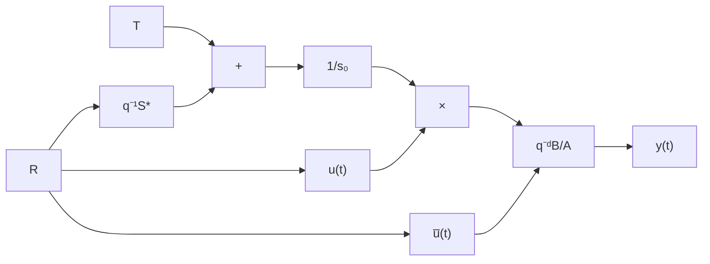

# 16.2.4 Effects of the Digital to Analog Converter

The values of the control signal computed by the control algorithm in fixed or floating arithmetics with 16, 32 or 64 bits have in general a number of distinct values higher than the distinct values of the digital-to-analog converter often limited to 12 bits (4096 distinct values). The characteristics of a digital-to-analog $( D / A )$ converter are illustrated in Fig. 16.2. In the equation of a digital controller, the control generated at time t depends upon the previous control values effectively applied to the system. It is therefore necessary to round off the control signal $u ( t )$ inside the controller and to use these values for the computation of the future values of the control signal. Equation (16.11) becomes:

$$u (t) = \frac {1}{s _ {0}} [ T (q ^ {- 1}) y ^ {*} (t + d + i) - S ^ {*} (q ^ {- 1}) u _ {r} (t - 1) - R (q ^ {- 1}) y (t) ] \tag {16.12}$$

where:

$$\left| u _ {r} (t) - u (t) \right| \leq \frac {1}{2} Q \tag {16.13}$$

and $u _ { r } ( t )$ is the rounded control effectively sent to the $D / A$ converter and $Q$ is the quantization step. If this rounding operation is not implemented, an equivalent noise is induced in the system which may cause undesirable small oscillations of the output in some situations.

Fig. 16.2 Input-output characteristics of a digital-to-analog converter   

line

| u (computed) | u_r |
| --- | --- |
| 0 | - |
| Q | 0 |

Fig. 16.3 Digital controller with anti-windup device   

flowchart

