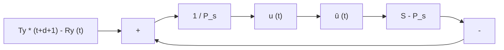

# 16.2.5 Handling Actuator Saturations (Anti-Windup)

The effect of actuator saturation can have an adverse effect upon the behavior of the control system and, in particular, when the controller contains an integrator. To avoid such troubles, one has to take into account the fact that the control at instant t depends upon the previous inputs effectively applied to the system. However, in order to avoid the use of an additional $A / D$ converter, a copy of the nonlinear characteristics of the actuator should be incorporated in the controller. This is illustrated in Fig. 16.3. The control signal will be given by:

$$u (t) = \frac {1}{s _ {0}} [ T (q ^ {- 1}) y ^ {*} (t + d + i) - S ^ {*} (q ^ {- 1}) \bar {u} (t - 1) - R (q ^ {- 1}) y (t) ] \tag {16.14}$$

In (16.14), $\bar { u } ( t - 1 ) , \bar { u } ( t - 2 ) , \ldots , \bar { u } ( t - n _ { s } )$ correspond to the values of $u ( t - 1 )$ , $\dots , u ( t - n _ { s } )$ passed through the nonlinear characteristics, i.e.:

$$
\bar {u} (t) = \left\{ \begin{array}{l l} u (t) & \text { if   } | u (t) | <   u _ {s a t} \\ u _ {s a t} & \text { if   } u (t) \geq u _ {s a t} \\ - u _ {s a t} & \text { if   } u (t) \leq - u _ {s a t} \end{array} \right. \tag {16.15}
$$

It is also possible to impose certain dynamic when the system leaves the saturation. This is illustrated in Fig. 16.4. The desired dynamic is defined by a polynomial

Fig. 16.4 Digital controller with pre-specified anti-windup dynamics   

flowchart

$P _ { S } ( q ^ { - 1 } ) \colon$

$$P _ {S} (q ^ {- 1}) = s _ {0} + q ^ {- 1} P _ {S} ^ {*} (q ^ {- 1}) \tag {16.16}$$

This configuration assures, however, that within the linear operation domain $( | u ( t ) | < u _ { s a t }  \bar { u } ( t ) = u ( t ) )$ , the transfer operator from $[ T ( q ^ { - 1 } ) y ^ { * } ( t + d + 1 ) -$ $R ( q ^ { - 1 } ) y ( t ) ]$ to u(t ) is still $1 / S ( q ^ { - 1 } )$ . Effectively, in the linear region one has:

$$\frac {\frac {1}{P _ {S} (q ^ {- 1})}}{1 - \frac {S (q ^ {- 1}) - P _ {S} (q ^ {- 1})}{P _ {S} (q ^ {- 1})}} = \frac {1}{S (q ^ {- 1})}$$

Therefore, in the presence of a nonlinear characteristics the controller equation takes the form:

$$
\begin{array}{l} P _ {S} (q ^ {- 1}) u (t) = T (q ^ {- 1}) y ^ {*} (t + d + i) - R (q ^ {- 1}) y (t) \\ - [ S ^ {*} (q ^ {- 1}) - P _ {S} ^ {*} (q ^ {- 1}) ] \bar {u} (t - 1) \tag {16.17} \\ \end{array}
$$

or, equivalently:

$$
\begin{array}{l} u (t) = \frac {1}{s _ {0}} \{T (q ^ {- 1}) y ^ {*} (t + d + i) - R ^ {*} (q ^ {- 1}) y (t) - [ S ^ {*} (q ^ {- 1}) - P _ {S} ^ {*} (q ^ {- 1}) ] \bar {u} (t - 1) \\ \left. - P _ {S} ^ {*} \left(q ^ {- 1}\right) u (t - 1) \right\} \tag {16.18} \\ \end{array}
$$

For more details see Landau and Zito (2005).
