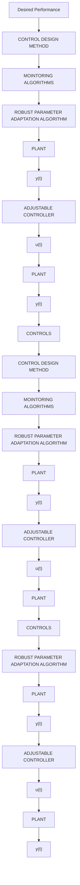

# 16.5 Initialization of Adaptive Control Schemes

For a certain type of system to be controlled, the design of an adaptive controller will in general require an a priori system identification in one or several operating situations. The system identification will allow to set up:

• the structure of the controller,   
• the performance specifications,   
• the underlying linear design method.

Information about the operating conditions of the system and the type of parameter variations will allow the type of adaptive control scheme to be selected and the conditional updating of the adaptation gain to be set up. The basic choices are:

• identification in closed loop followed by controller redesign;   
• adaptive control with vanishing adaptation gain and resetting;   
• adaptive control with non-vanishing adaptation gain.

The first two schemes are used when the plant model parameters are constant over large time horizons and change significantly from time to time. When the plant model parameters vary almost continuously, adaptive control with non-vanishing gain should be used. Constant trace adaptation gain is suitable in these situations. The choice of the desired constant trace is a trade off between the speed of variation of the parameters and the level of noise. The test of the signal richness in these cases is necessary in general (an exception: use of F-CLOE algorithm). To start the adaptation algorithm, one combines variable forgetting factor algorithm with constant trace algorithm (see Sects. 16.3 and 3.2.3).

flowchart

Fig. 16.6 Adaptive control system with monitoring

To effectively start up an adaptive control scheme, one uses a parameter estimation in open loop or in closed loop (with a fixed parameters controller) using an external excitation signal over a short time horizon $\geq 1 0 n _ { p }$ (if the excitation is sufficiently rich), where $n _ { p }$ is the number of parameters to be estimated and then one switches to the adaptive control scheme (with appropriate initialization of the controller as discussed in Sect. 16.2).
