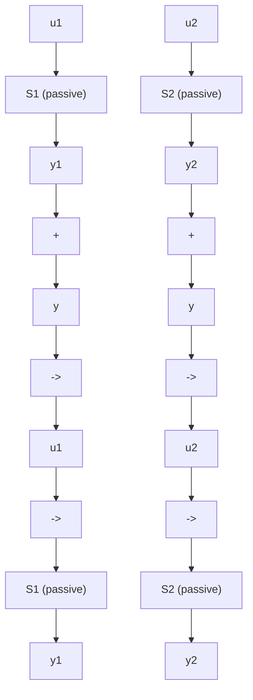

# C.2 Passivity—Some Definitions

The norm of a vector is defined as:

$$\| x (t) \| = \left(x ^ {T} x\right) ^ {1 / 2}; \quad x \in R _ {n}$$

The norm $L _ { 2 }$ is defined as:

$$\| x (t) \| _ {2} = \left(\sum_ {0} ^ {\infty} x ^ {T} (t) x (t)\right) ^ {1 / 2}$$

where $x ( t ) \in \mathbb { R } _ { n }$ and t is an integer (it is assumed that all signals are 0 for $t < 0 )$ . To avoid the assumption that all signals go to zero as $t \to \infty$ , one uses the extended $L _ { 2 }$ space denoted $L _ { 2 e }$ which contains the truncated sequences:

$$
x _ {T} (t) = \left\{ \begin{array}{l l} x (t) & 0 \leq t \leq T \\ 0 & t > T \end{array} \right.
$$

Consider a system S with input u and output y (of same dimension). Let us define the input-output product:

$$\eta (0, t _ {1}) = \sum_ {t = 0} ^ {t _ {1}} y ^ {T} (t) u (t)$$

Definition C.1 A system S is termed passive if:

$$\eta (0, t _ {1}) \geq - \gamma^ {2}; \quad \gamma^ {2} < \infty ; \forall t _ {1} \geq 0$$

Definition C.2 A system S is termed input strictly passive if:

$$\eta (0, t _ {1}) \geq - \gamma^ {2} + \kappa \| u \| _ {2 T} ^ {2}; \quad \gamma^ {2} < \infty ; \kappa > 0; \forall t _ {1} \geq 0$$

Definition C.3 A system S is termed output strictly passive if:

$$\eta (0, t _ {1}) \geq - \gamma^ {2} + \delta \| y \| _ {2 T} ^ {2}; \quad \gamma^ {2} < \infty ; \delta > 0; \forall t _ {1} \geq 0$$

Definition C.4 A system S is termed very strictly passive if:

$$\eta (0, t _ {1}) \geq - \gamma^ {2} + \kappa \| u \| _ {2 T} ^ {2} + \delta \| y \| _ {2 T} ^ {2}; \quad \gamma^ {2} < \infty ; \delta > 0; \kappa > 0; \forall t _ {1} \geq 0$$

In all the above definitions, the term $\gamma ^ { 2 }$ will depend upon the initial conditions. If a state space representation (state vector: x) can be associated to the system S, one can introduce also the following lemmas:

Lemma C.1 The system resulting from the parallel connection of two passive blocks is passive.

Lemma C.2 The system resulting from the negative feedback connection of two passive blocks is passive.

flowchart

Fig. C.1 Parallel and feedback connections of two passive blocks
