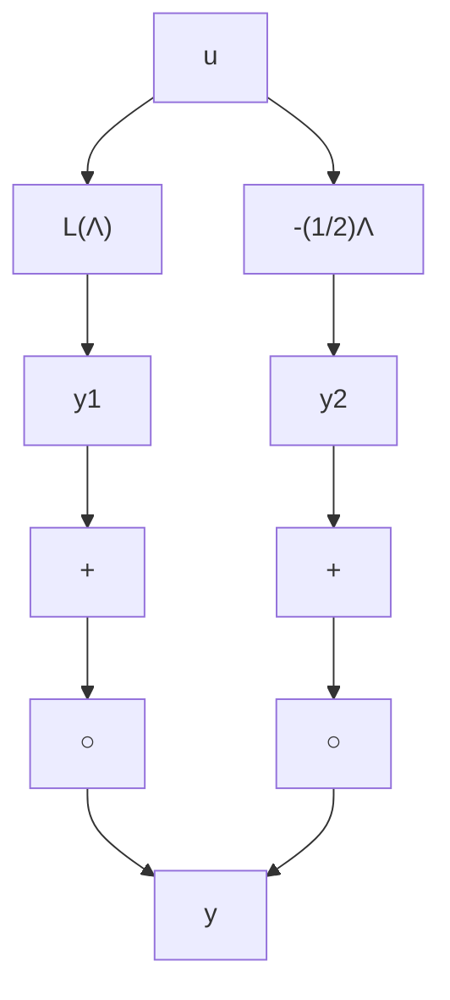

• The system (C.1)–(C.2) is input strictly passive   
• H (z) is positive real

4. For $M _ { 0 } \geq 0 , \varDelta > 0 , K \geq 0$

• The system (C.1)–(C.2) is output strictly passive   
• H (z) is positive real

5. For $M _ { 0 } > 0 , \varDelta \geq 0 , K > 0$

• The system (C.1)–(C.2) is input strictly passive   
• The system (C.1)–(C.2) is state strictly passive   
• H (z) is strictly positive real

6. For $M _ { 0 } > 0 , \varDelta > 0 , K \geq 0$

• The system (C.1)–(C.2) is output strictly passive   
• The system (C.1)–(C.2) is state strictly passive   
• H (z) is strictly positive real

7. For $M _ { 0 } > 0 , \varDelta > 0 , K > 0$

• The system (C.1)–(C.2) is very strictly passive   
• The system (C.1)–(C.2) is state strictly passive   
• H (z) is strictly positive real

Proof The properties (2) through (7) result from the property (1) bearing in mind the various definitions of passivity and the properties of positive and strictly positive real transfer matrices. We will show next that (C.14) through (C.17) implies property (C.18). Denoting:

$$\bar {Q} = Q + C ^ {T} \Delta C + M _ {0} \tag {C.19}\bar {S} = S + C ^ {T} \Delta D \tag {C.20}\bar {R} = R + D ^ {T} \Delta D + K \tag {C.21}
\bar {M} = \left[ \begin{array}{l l} \bar {Q} & \bar {S} \\ \bar {S} ^ {T} & \bar {R} \end{array} \right] \tag {C.22}
$$

Fig. C.2 The class L(Λ)   

flowchart

one can use the result (C.11) of Lemma C.3, which yields:

$$
\begin{array}{l} \sum_ {t = 0} ^ {t _ {1}} y ^ {T} (t) u (t) = \frac {1}{2} x ^ {T} \left(t _ {1} + 1\right) P x \left(t _ {1} + 1\right) - \frac {1}{2} x ^ {T} (0) P x (0) \\ + \frac {1}{2} \sum_ {t = 0} ^ {t _ {1}} [ x ^ {T} (t), u ^ {T} (t) ] \bar {M} \left[ \begin{array}{l} x (t) \\ u (t) \end{array} \right] \tag {C.23} \\ \end{array}
$$

Taking into account the particular form of $\bar { M } .$ , one obtains:
