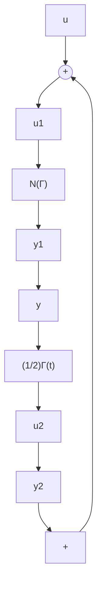

# C.4 Discrete Linear Time-Varying Passive Systems

Consider the discrete linear time-varying system:

$$\bar {x} (t + 1) = A (t) \bar {x} (t) + B (t) \bar {u} (t) \tag {C.27}\bar {y} (t) = C (t) \bar {x} (t) + D (t) \bar {u} (t) \tag {C.28}$$

where $\bar { x } , \bar { u } , \bar { y }$ are the state, the input and the output vectors respectively $( \bar { u }$ and $\bar { y }$ are of the same dimension), and $A ( t ) , B ( t ) , C ( t ) , D ( t )$ are sequences of time-varying matrices of appropriate dimensions defined for all $t \geq 0$ .

Lemma C.6 The system (C.27)–(C.28) is passive if one of the following equivalent propositions holds:

1. There are sequences of time-varying positive semidefinite matrices $\bar { P } ( t )$ , of positive semidefinite matrices $Q ( t )$ and $R ( t )$ and a matrix sequence $S ( t )$ such that:

$$A ^ {T} (t) \bar {P} (t + 1) A (t) - \bar {P} (t) = - Q (t) \tag {C.29}C (t) - B ^ {T} (t) \bar {P} (t + 1) A (t) = S (t) \tag {C.30}D (t) + D ^ {T} (t) - B ^ {T} (t) P (t + 1) B (t) = R (t) \tag {C.31}
\bar {M} (t) = \left[ \begin{array}{c c} Q (t) & S (t) \\ S ^ {T} (t) & R (t) \end{array} \right] \geq 0 \quad (\mathrm{C.32})
$$

with $\bar { P } ( 0 )$ bounded.

2. Every solution $x ( t ) ( x ( 0 ) , u ( t ) , t )$ of (C.27)–(C.28) satisfies the following equality:

Fig. C.3 The class N(Γ )   

flowchart

$$
\begin{array}{l} \sum_ {t = 0} ^ {t _ {1}} \bar {y} ^ {T} (t) \bar {u} (t) = \frac {1}{2} x ^ {T} (t _ {1} + 1) \bar {P} (t + 1) x (t _ {1} + 1) - \frac {1}{2} x ^ {T} (0) \bar {P} (0) x (0) \\ + \frac {1}{2} \sum_ {t = 0} ^ {t _ {1}} [ \bar {x} ^ {T} (t), \bar {u} ^ {T} (t) ] \bar {M} (t) \left[ \begin{array}{l} \bar {x} (t) \\ \bar {u} (t) \end{array} \right] \tag {C.33} \\ \end{array}
$$

Proof The passivity property results from (C.33). To obtain (C.33) from (C.32), one follows exactly the same steps as for the proof of Lemma C.3. -

For the study of the stability of interconnected systems, it is useful to consider the class of linear time-varying discrete time systems defined next.

Definition C.13 (Landau and Silveira 1979) The linear time-varying system (C.27)–(C.28) is said to belong to the class $N ( T )$ if for a given sequence of symmetric matrices $T ( t ) \geq 0$ of appropriate dimension, one has:
