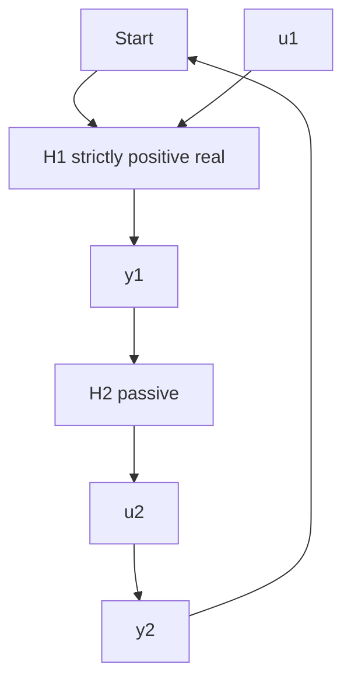
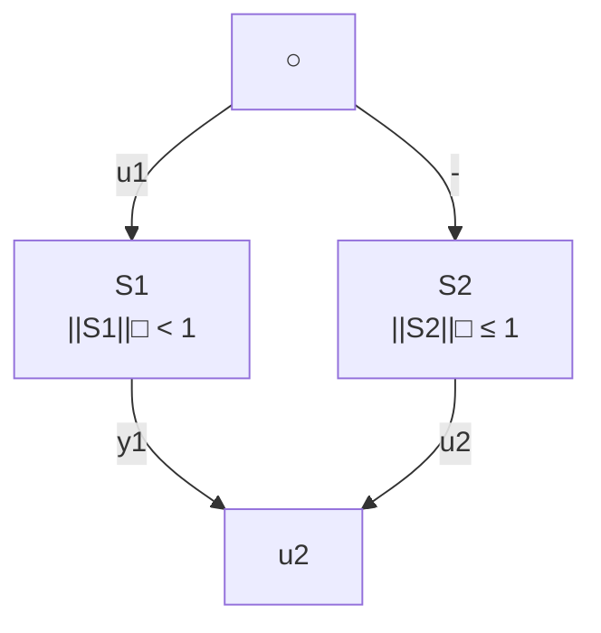

# C.6 Hyperstability and Small Gain

Theorem C.2 (Asymptotic Hyperstability) Consider the feedback connection (Fig. C.4) of a linear time-invariant block $H _ { 1 }$ (state: x(t)), characterized by a strictly positive real transfer function (which implies that $H _ { 1 }$ is input strictly passive) with a block $H _ { 2 }$ (linear or nonlinear, time invariant or time-varying) characterized by:

Fig. C.4 Feedback connection (hyperstability)   

flowchart

$$\eta_ {2} (0, t _ {1}) = \sum_ {t = 0} ^ {t _ {1}} y _ {2} ^ {T} (t) u _ {2} (t) \geq - \gamma_ {2} ^ {2}; \quad \gamma_ {2} ^ {2} < \infty ; \forall t _ {1} \geq 0 \tag {C.58}$$

Then:

$$\lim _ {t \to \infty} x (t) = 0; \quad \lim _ {t \to \infty} u _ {1} (t) = \lim _ {t \to \infty} y _ {1} (t) = 0; \quad \forall x (0) \tag {C.59}$$

The proof is similar to that of Theorem C.1 and it is omitted.

Definition C.14 Consider a system S with input u and output y, the infinity norm of the system S denoted $\| S \| _ { \infty }$ is such that:

$$\| y \| _ {2} ^ {2} \leq \| S \| _ {\infty} ^ {2} \| u \| _ {2} ^ {2}$$

Definition C.15 Given a transfer function H (z), the infinity norm $\| H \| _ { \infty }$ is:

$$\| H \| _ {\infty} = \max _ {\omega} | H (e ^ {j \omega}) |; \quad 0 \leq \omega \leq 2 \pi$$

Lemma C.8 (Small Gain Lemma) The following propositions concerning the system of (C.1)–(C.2) are equivalent to each other:

1. H (z) given by (C.3) satisfies:

$$\| H (z ^ {- 1}) \| _ {\infty} \leq \gamma ; \quad 0 < \gamma < \infty \tag {C.60}$$

2. There exist a positive definite matrix P , a positive semidefinite matrix Q and matrices S and R such that:

$$A ^ {T} P A - P = - Q - C ^ {T} C \tag {C.61}- B ^ {T} P A = S ^ {T} + D ^ {T} C \tag {C.62}B ^ {T} P B = R + D ^ {T} D - \gamma^ {2} I \tag {C.63}
M = \left[ \begin{array}{l l} Q & S \\ S ^ {T} & R \end{array} \right] \geq 0 \tag {C.64}
$$

3. There is a positive definite matrix P and matrices K and L such that:

Fig. C.5 Feedback connection (small gain)   

flowchart

