```mermaid
graph TD
    subgraph S1
        A["u1"] --> B["2I"]
        B --> C["+"]
        C --> D["y1"]
        D --> E["+"]
        E --> F["y2"]
        F --> G["+"]
        G --> H["+"]
        H --> I["+"]
        I --> J["+"]
        J --> K["+"]
        K --> L["+"]
        L --> M["+"]
        M --> N["+"]
        N --> O["+"]
        O --> P["+"]
        P --> Q["+"]
        Q --> R["+"]
        R --> S["+"]
        S --> T["+"]
        T --> U["+"]
        U --> V["+"]
        V --> W["+"]
        W --> X["+"]
        X --> Y["+"]
        Y --> Z["+"]
        Z --> AA["+"]
        AA --> AB["+"]
        AB --> AC["+"]
        AC --> AD["+"]
        AD --> AE["+"]
        AE --> AF["+"]
        AF --> AG["+"]
        AG --> AH["+"]
        AH --> AI["+"]
        AI --> AJ["+"]
        AJ --> AK["+"]
        AK --> AL["+"]
        AL --> AM["+"]
        AM --> AN["+"]
        AN --> AO["+"]
        AO --> AP["+"]
        AP --> AQ["+"]
        AQ --> AR["+"]
        AR --> AS["+"]
        AS --> AT["+"]
        AT --> AU["+"]
        AU --> AV["+"]
        AV --> AW["+"]
        AW --> AX["+"]
        AX --> AY["+"]
        AY --> AZ["+"]
        AZ --> BA["+"]
        BA --> BB["+"]
        BB --> BC["+"]
        BC --> BD["+"]
        BD --> BE["+"]
        BE --> BF["+"]
        BF --> BG["+"]
        BG --> BH["+"]
        BH --> BI["+"]
        BI --> BJ["+"]
        BJ --> BK["+"]
        BK --> BL["+"]
        BL --> BM["+"]
        BM --> BN["+"]
        BN --> BO["+"]
        BO --> BP["+"]
        BP --> BQ["+"]
        BQ --> BR["+"]
        BR --> BS["+"]
        BS --> BT["+"]
        BT --> BU["+"]
        BU --> BV["+"]
        BV --> BW["+"]
        BW --> BX["+"]
        BX --> BY["+"]
        BY --> BZ["+"]
        BZ --> CA["+"]
        CA --> CB["+"]
        CB --> CC["+"]
        CC --> CD["+"]
        CD --> CE["+"]
        CE --> CF["+"]
        CF --> CG["+"]
        CG --> CH["+"]
        CH --> CI["+"]
        CI --> CJ["+"]
        CJ --> CK["+"]
        CK --> CL["+"]
        CL --> CM["+"]
        CM --> CN["+"]
        CN --> CO["+"]
        CO --> CP["+"]
        CP --> CQ["+"]
        CQ --> CR["+"]
        CR --> CS["+"]
        CS --> CT["+"]
        CT --> CU["+"]
        CU --> CV["+"]
        CV --> CW["+"]
        CW --> CX["+"]
        CX --> CY["+"]
        CY --> CZ["+"]
    end
    subgraph S2
        AD["u2"] --> AE["H2 passive"]
    end
    S1 -.-> AD
    S2 -.-> AE
    style S1 fill:#f9f,stroke:#333
    style S2 fill:#ccf,stroke:#333
```

Proof The small gain theorem (Theorem C.3) can be obtained from Theorem C.2, using a series of equivalent loop transformation on the scheme of Fig. C.4 leading to the scheme shown in Fig. C.6, where the input-output operator $S _ { 1 } \left( y _ { 1 } = S _ { 1 } u _ { 1 } \right)$ is given by:

$$S _ {1} = (H _ {1} - I) (H _ {1} + I) ^ {- 1} \tag {C.73}$$

and the operator $S _ { 2 } ( y _ { 2 } = S _ { 2 } u _ { 2 } )$ is given by:

$$S _ {2} = \left(H _ {2} - I\right) \left(H _ {2} + I\right) ^ {- 1} \tag {C.74}$$

It can be shown (Desoer and Vidyasagar 1975) that under the hypotheses of Theorem C.2, $\| S _ { 1 } \| _ { \infty } < 1$ and $\| S _ { 2 } \| _ { \infty } \leq 1$ . -
