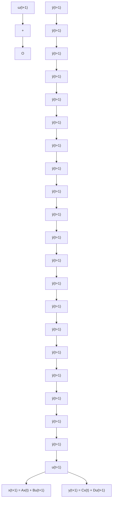

# Appendix D Martingales

This appendix gives a number of results related to the properties of feedback systems in the presence of stochastic disturbances represented as a martingale sequence (for the definition of a martingale sequence see Appendix A). The properties of passive (hyperstable) systems are extensively used in relation to some basic results concerning the convergence of non-negative random variables. The results of this appendix are useful for the proofs of Theorems 4.2 and 4.3, as well as for the convergence analysis of various recursive identification and adaptive control schemes.

Theorem D.1 (Neveu 1975) $I f T ( t )$ and $\alpha ( t + 1 )$ are non-negative random variables measurable with respect to an increasing sequence of σ -algebras $\mathcal { F } _ { t }$ and satisfy:

$( 1 ) \quad \mathbf { E } \{ T ( t + 1 ) | \mathcal { F } _ { t } \} \leq T ( t ) + \alpha ( t + 1 )$ (D.1)

(2) $\sum _ { t = 1 } ^ { \infty } \alpha ( t ) < \infty ; \quad a . s .$ (D.2)

then:

$$\lim _ {t \to \infty} T (t) = T \quad a. s. \tag {D.3}$$

where T is a finite non-negative random variable.

Consider the stochastic feedback system shown in Fig. D.1 and described by:

$$x (t + 1) = A x (t) + B u (t + 1) \tag {D.4}y (t + 1) = C x (t) + D u (t + 1) \tag {D.5}\bar {u} (t + 1) = y (t + 1) + \omega (t + 1) \tag {D.6}\bar {x} (t + 1) = A (t) \bar {x} (t) + B (t) \bar {u} (t + 1) \tag {D.7}\bar {y} (t + 1) = - u (t + 1) = C (t) \bar {x} (t) + D (t) \bar {u} (t + 1) \tag {D.8}$$

Note that the output of the linear time-invariant feedforward block described by (D.4) and (D.5) is disturbed by the sequence $\{ \omega ( t + 1 ) \}$ }. The following assumptions are made upon the system of (D.4)–(D.8).

Fig. D.1 Stochastic feedback system associated with (D.4) through (D.8)   

flowchart

