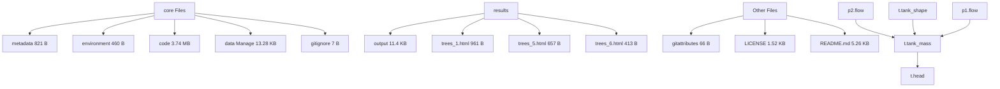

# # translation function

translation pipe -> junction: pipe.flow -> junction.junction\_mass, junction.junction\_mass -> pipe.flow, junction.head->pipe.link\_energy

translation junction -> pipe: pipe.flow -> junction.junction\_mass, junction.junction\_mass -> pipe.flow, junction.head->pipe.link\_energy

translation pipe -> tank:pipe.flow -> tank.tank\_mass,tank.head -> pipe.link\_energy

translation tank -> pipe:pipe.flow -> tank.tank\_mass,tank.head -> pipe.link\_energy


<details>
<summary>text_image</summary>

Shared iCPS-DL: A Description Language for Autonomic Industrial Cyber-Physical Systems
Capsule File Help
Files
App Builder
Core Files ?
> metadata 821 B
> environment 460 B
> code 3.74 MB
> data Manage 13.28 KB
> gitignore 7 B
Results ?
results 13.39 KB
output 11.4 KB
trees_1.html 961 B
trees_5.html 657 B
trees_6.html
s6
t.head
</details>


<details>
<summary>flowchart</summary>


</details>

Fig. 9. Mermaid diagrams created by autonomic supervisor when running the CodeOcean module. Top: Mermaid diagram of state estimator tree T1 Bottom: Mermaid diagram of state estimator tree 2 sim sim .

```txt
translation pump -> junction:
pump.flow -> junction.junction_mass,
junction.junction_mass -> pump.flow,
junction.head->pump.link_energy 
```

```txt
translation junction -> pump:
pump.flow -> junction.junction_mass,
junction.junction_mass -> pump.flow,
junction.head->pump.link_energy 
```

```ocaml
translation pump -> tank:
pump.flow -> tank.tank_mass
```

```txt
translation tank -> pump:
pump.flow -> tank.tank_mass
```
