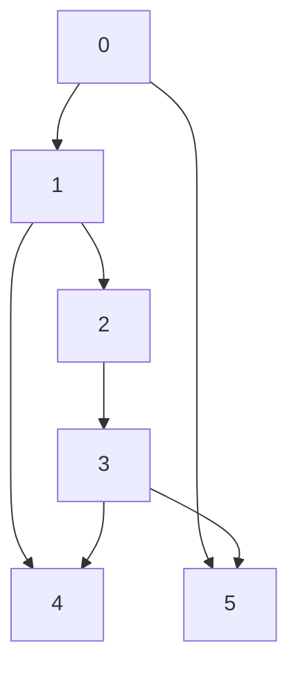

# V. NUMERICAL EXAMPLE

We consider a leader-follower multi-agent formation with one leader and five followers, where each agent has distinct nonlinear dynamics influenced by external disturbances. Figure 1 shows the information flow structure of the multi-agent system. The leader’s dynamics are given by:

Leader:

$$\dot {s _ {0}} = v _ {0} \tag {58}
\begin{array}{l} \dot {v _ {0}} = - 3 v _ {0} + 1 - g \sin (\alpha (s _ {0})) - \frac {0 . 4 v _ {0} ^ {2}}{m _ {0}} \\ + \frac {3 \sin (2 t) + 6 \cos (2 t)}{m _ {0}} - \frac {(s _ {0} + v _ {0} - 1) ^ {2}}{3 m _ {0}} (s _ {0} + 4 v _ {0} - 1) \\ \end{array}
$$

Each follower $i \ ( i = 1 , \ldots , 5 )$ has second-order nonlinear dynamics:

Agent 1:

$$\dot {s _ {1}} = v _ {1} \tag {59}
\begin{array}{l} \dot {v _ {1}} = \frac {v _ {1} \sin (s _ {1})}{m _ {1}} + \cos^ {2} (v _ {1}) - \frac {0 . 4 7 v _ {1} ^ {2}}{m _ {1}} - g \sin (\alpha (s _ {1})) + \frac {u _ {1}}{m _ {1}} \\ + \frac {\zeta_ {1}}{m _ {1}} \\ \end{array}
$$

Agent 2:

$$\dot {s} _ {2} = v _ {2} \tag {60}
\begin{array}{l} \dot {v _ {2}} = \frac {- (s _ {2}) ^ {2} v _ {2}}{m _ {2}} + \cos^ {2} (v _ {2}) - \frac {0 . 5 2 v _ {2} ^ {2}}{m _ {2}} - g \sin (\alpha (s _ {2})) + \frac {u _ {2}}{m _ {2}} \\ + \frac {\zeta_ {2}}{m _ {2}} \\ \end{array}
$$

Agent 3:

$$\dot {s _ {3}} = v _ {3} \tag {61}
\begin{array}{l} \dot {v _ {3}} = \frac {- (s _ {3}) ^ {2} v _ {3}}{m _ {3}} + \sin^ {2} (v _ {3}) - \frac {0 . 5 7 v _ {3} ^ {2}}{m _ {3}} - g \sin (\alpha (s _ {3})) + \frac {u _ {3}}{m _ {3}} \\ + \frac {\zeta_ {3}}{m _ {3}} \\ \end{array}
$$

Agent 4:

$$\dot {s _ {4}} = v _ {4} \tag {62}
\begin{array}{l} \dot {v _ {4}} = \frac {- 3 (s _ {4} + v _ {4} - 1) ^ {2} (s _ {4} + v _ {4} - 1)}{m _ {4}} - v _ {4} + 0. 5 \sin (2 t) \\ + \cos (2 t) - \frac {0 . 6 5 v _ {4} ^ {2}}{m _ {4}} - g \sin (\alpha (s _ {4})) + \frac {u _ {4}}{m _ {4}} + \frac {\zeta_ {4}}{m _ {4}} \\ \end{array}
$$

Agent 5:

$$\dot {s _ {5}} = v _ {5} \tag {63}\dot {v _ {5}} = \cos (s _ {5}) - \frac {0 . 7 4 v _ {5} ^ {2}}{m _ {5}} - g \sin (\alpha (s _ {5})) + \frac {u _ {5}}{m _ {5}} + \frac {\zeta_ {5}}{m _ {5}}$$

flowchart

Fig. 1: The Considered Fixed Topology of the augmented graph G¯ in Section V.

line

