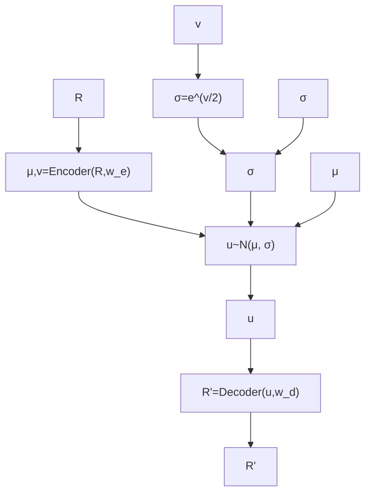
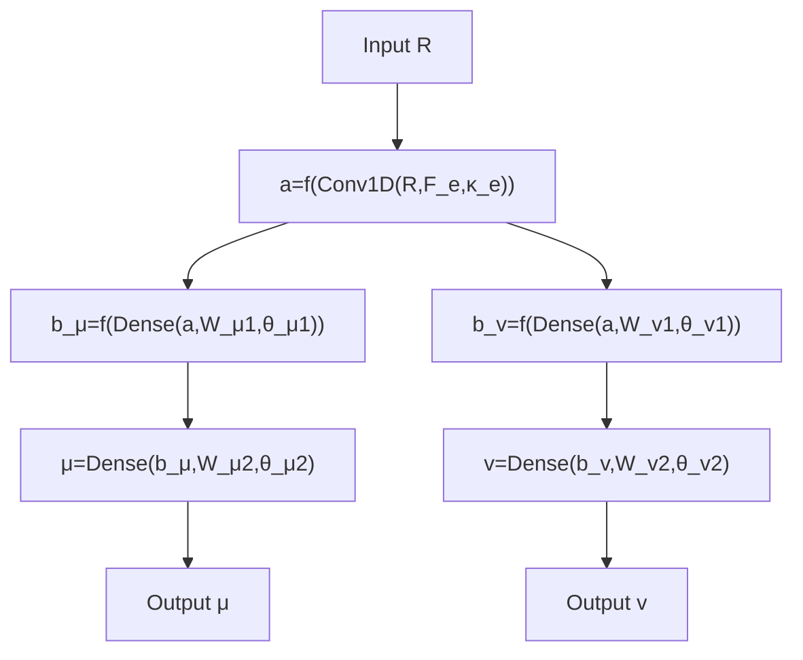

# Appendix B: Structure of VAE in detail

The VAE we create for our problem is shown in Fig. 15. Figure 15(a) demonstrates its common structure and in Figs. 15(b, c) the inner structures of the encoder and decoder are shown.

The input vector R is forwarded to the encoder that maps it to a couple of vectors $\mu , \nu \in \mathbb { R } ^ { D _ { u } }$ . Their dimension $D _ { u } < D _ { e }$ is the dimension of the reconstructed dynamical system. The vector ν is treated as a logarithm of a variance, and $\sigma = \mathrm { e } ^ { \nu / 2 }$ is a standard deviation. The vectors $\mu$ and σ defines so called a latent space. Elements of this space are vectors u that represent the reduced form of R. Vectors u from the latent space are taken as a random samples of a normal distribution $N ( \mu , \sigma )$ . So, when $\mu$ and $\sigma$ are generated for the input R the vector u is sampled and then sent to the decoder. It maps this vector to $R ^ { \prime }$ . The goal of VAE training is minimization of the discrepancy between R and R′ by tuning parameter vectors of the encoder $w _ { e }$ and the decoder $w _ { d }$ . Also a proper latent space structure has to be provided that is achieved by simultaneous minimization of the Kullback–Leibler divergence between the distribution parameterized by µ and σ and standard normal distribution20. Thus the loss function for VAE training includes two terms21: the discrepancy between R and $\mathrm { \Delta } \ddot { R } ^ { \prime }$ that we compute as a mean squared error and the mean Kullback–Leibler divergence computed via µ and ν:

flowchart

flowchart

flowchart

