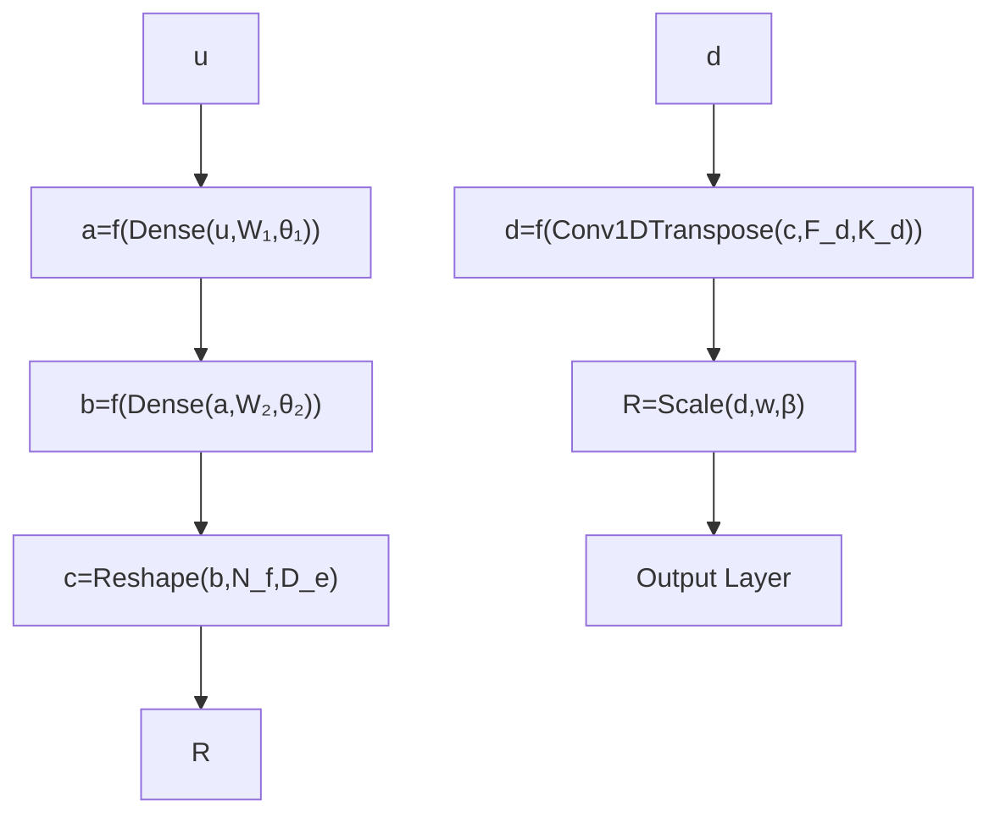

FIG. 15. VAE: (a) general structure; (b) and (c) inner structure of the encoder and decoder, respectively. R is the input vector; µ and σ are parameters of the latent space; u is a vector of the latent space sampled from the Gaussian distribution $N ( \mu , \sigma )$ ; $R ^ { \prime }$ is the output vector; $w _ { e }$ and $w _ { d }$ are vectors of trainable parameters (neural networks weights) of the encoder and the decoder respectively: $w _ { e } = \{ F _ { e } , \kappa _ { e } , W _ { \mu 1 , 2 } , \theta _ { \mu 1 , 2 } , , W _ { \nu 1 , 2 } , \theta _ { \nu 1 , 2 } \}$ , $\begin{array} { r l } { w _ { d } } & { { } = } \end{array}$ $\{ W _ { 1 , 2 } , \theta _ { 1 , 2 } , F _ { d } , \kappa _ { d } , w , \beta \}$ .

$$L = \left\langle (R - R ^ {\prime}) ^ {2} \right\rangle_ {D _ {e}} + K \left\langle \mu^ {2} + \mathrm{e} ^ {\nu} - \nu - 1 \right\rangle_ {D _ {u}} \quad (\mathrm{B1})$$

The first and the second terms are averaged over $D _ { e }$ and $D _ { u }$ components of the corresponding vectors, respectively. The coefficient K is introduced to balance minimization rates of the two terms: one sees that the first one can be arbitrary small while the second one is at least $O ( 1 )$ . Thus the value of K has to be of the order of the acceptable recovery error. We are going to continue the training until the mean squared recovery error is of the order $1 \bar { 0 } ^ { - 5 }$ . Thus we set $\bar { K } = 1 0 ^ { - 5 }$ .
