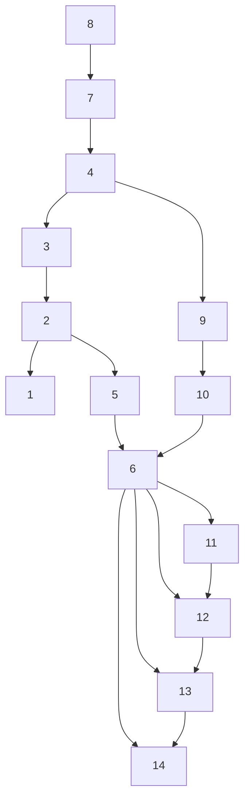
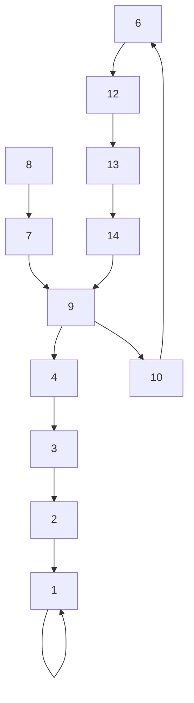

flowchart

(a) Original cyber topology with Node 1 as the root node (before attack).

flowchart

(b) Rerouted cyber topology (after attack).

Fig. 2: Construction of cyber communication networks (black solid lines denote the physical power lines, critical cyber nodes are colored in orange).   
bus 6. Fig. 3 shows the shows the generators’ generations after   

line

| Time Slot | Generator 1 | Generator 2 | Generator 3 | Generator 6 | Generator 8 |
| --- | --- | --- | --- | --- | --- |
| 0 | 25 | 125 | 100 | 85 | 20 |
| 1 | 25 | 115 | 100 | 80 | 20 |
| 2 | 30 | 95 | 100 | 75 | 20 |
| 3 | 25 | 125 | 100 | 85 | 20 |
| 4 | 45 | 140 | 100 | 100 | 20 |
| 5 | 45 | 140 | 100 | 100 | 20 |
| 6 | 45 | 140 | 100 | 0 | 20 |
| 7 | 45 | 140 | 100 | 0 | 20 |
| 8 | 50 | 140 | 100 | 0 | 20 |
| 9 | 45 | 140 | 100 | 0 | 20 |
| 10 | 45 | 140 | 100 | 0 | 20 |
| 11 | 25 | 125 | 100 | 0 | 20 |

Fig. 3: Active power generation of all generators after the cyber-physical attack.

line

| Time Slot | Generator 6 Power (kW) | ESS at Bus 6 Power (kW) | Generator 6 Voltage (p.u.) | ESS at Bus 6 Voltage (p.u.) |
| --- | --- | --- | --- | --- |
| 0 | 80 | 0 | 1.05 | 0.95 |
| 2 | 75 | 0 | 1.05 | 0.95 |
| 4 | 100 | 0 | 1.05 | 0.95 |
| 6 | 0 | 30 | 1.05 | 0.95 |
| 8 | 0 | 30 | 1.05 | 0.95 |
| 10 | 0 | 30 | 1.05 | 0.95 |
| 12 | 0 | 30 | 1.05 | 0.95 |

Fig. 4: Active charging/discharging power of the ESS, and voltage magnitude of Bus 6 (before and after mitigation).

power the physical systems after the attack. The lower figure shows that the voltage magnitude of Bus 6 drops quickly after the attack, and the mitigation is effective in regulating the voltage to stay within the voltage limits.
