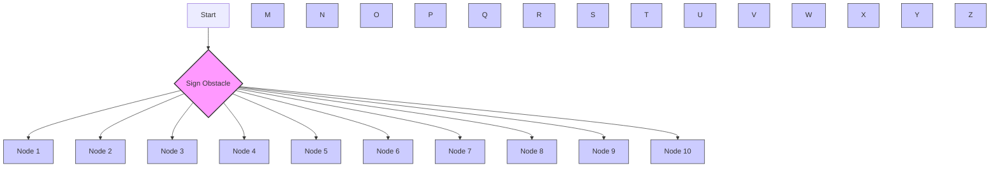

Fig. 5: Four Husarion ROSbot 2 PRO robots [22] position swapping game with one static obstacle using our method. The filled circle with the same colored arrow represents the goal position of the corresponding robot. The curves are the corresponding real trajectories.

$$
\mathbf {v} _ {i} = \left[ \begin{array}{c c} \cos (\theta) & \sin (\theta) \\ - \frac {1}{l} \sin (\theta) & \frac {1}{l} \cos (\theta) \end{array} \right] \mathbf {u} _ {i} \tag {24}
$$

l is a small distance defining the mapped distance in alignment with the positive direction of the robot’s orientation.
