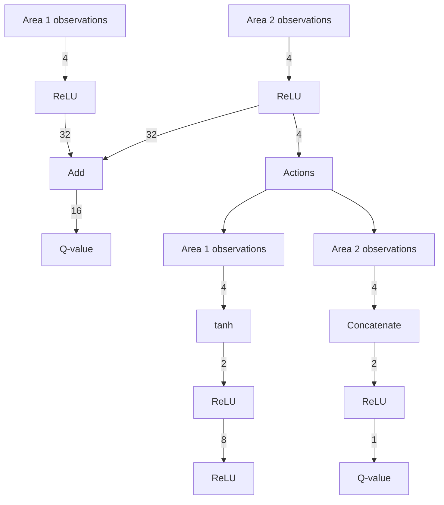

It is worth noting that further optimization of the RL agent’s policy can be achieved through adjustments to the agent’s reward function and hyperparameters. Our primary emphasis is on demonstrating the effectiveness of the CBF-based safe RL framework.

line

| Time | PI | RL |
| --- | --- | --- |
| 0 | 0.0000 | 0.0000 |
| 5 | -0.015 | -0.018 |
| 10 | -0.008 | -0.007 |
| 15 | -0.003 | -0.004 |
| 20 | 0.001 | 0.001 |
| 25 | 0.002 | 0.002 |
| 30 | 0.003 | 0.003 |
| 35 | 0.003 | 0.003 |
| 40 | 0.003 | 0.003 |
| 45 | 0.003 | 0.003 |
| 50 | 0.003 | 0.003 |
| 55 | 0.003 | 0.003 |
| 60 | 0.003 | 0.003 |
| 65 | 0.003 | 0.003 |
| 70 | 0.003 | 0.003 |
| 75 | 0.003 | 0.003 |
| 80 | 0.003 | 0.003 |

line

| x | Δf₁ (Hz) - Blue Line | Δf₁ (Hz) - Red Line |
| --- | --- | --- |
| 0 | 0.05 | 0.0 |
| 5 | -0.05 | -0.1 |
| 10 | 0.0 | -0.05 |
| 15 | 0.0 | -0.02 |
| 20 | 0.0 | 0.0 |
| 25 | 0.0 | 0.0 |
| 30 | 0.0 | 0.0 |
| 35 | 0.0 | 0.0 |
| 40 | 0.0 | 0.0 |
| 45 | 0.0 | 0.0 |
| 50 | 0.0 | 0.0 |
| 55 | 0.0 | 0.0 |
| 60 | 0.0 | 0.0 |
| 65 | 0.0 | 0.0 |
| 70 | 0.0 | 0.0 |
| 75 | 0.0 | 0.0 |
| 80 | 0.0 | 0.0 |

line

| Time (s) | Δf₂ (Hz) |
| --- | --- |
| 0 | 0.0 |
| 5 | -0.1 |
| 10 | -0.05 |
| 15 | -0.02 |
| 20 | -0.01 |
| 25 | 0.0 |
| 30 | 0.0 |
| 35 | 0.0 |
| 40 | 0.0 |
| 45 | 0.0 |
| 50 | 0.0 |
| 55 | 0.0 |
| 60 | 0.0 |
| 65 | 0.0 |
| 70 | 0.0 |
| 75 | 0.0 |
| 80 | 0.0 |

Fig. 5. Comparing the AGC performance of PI control to the RL agent in terms of (a) tie-line power flow and (b) frequency deviations in Area 1 and (c) Area 2.   

flowchart

Fig. 6. RL agent neural network architecture. The blue and red networks show the critic and actor, respectively.
