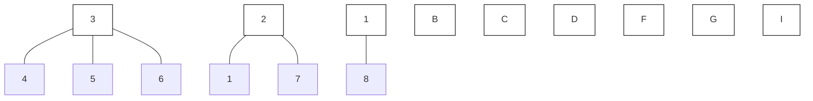

Since $\delta _ { N _ { i } ^ { i } } ^ { i } ( t )$ are design choices for all $\textit { i } \in \mathcal { V }$ and all $j \in \mathcal { N } _ { i } ^ { k - \mathrm { h o p } }$ , they can be designed to satisfy Assumption 6. Thus, Assumption 6 is also not restrictive in practice.

Theorem 4: Consider a heterogeneous MAS system (1) with connected graph G and distributed observers (12). Suppose each agent executes the control law in (23). Then, under Assumption 6, the MAS trajectory evolves toward $\mathcal { A } _ { \epsilon } = \{ \pmb { x } : \| \pmb { x } \| _ { A } < \gamma ( \overline { { \delta } } _ { \widetilde { \pmb { x } } } ) \}$ if $\Phi ( { \pmb x } , \tilde { { \pmb x } } , t )$ is set-ISS with respect to A and the feedback controller in (22) ensures convergence of the MAS towards A regardless of ${ \pmb w } ( { \pmb x } , t )$ .

Proof: Theorem 1 guarantees $| \tilde { x } _ { i } ^ { N _ { j } ^ { i } } ( t ) | \ < \ \delta _ { i } ^ { N _ { j } ^ { i } } ( t )$ to hold for all $i \in \mathcal { V } , N _ { j } ^ { i } \in \bar { \mathcal { N } } _ { i } ^ { k \mathrm { - h o p } }$ , and $t \in \mathbb { R } _ { \geq 0 }$ i. Thus, under Assumption 6, there exists $t _ { x }$ such that $\| \tilde { \mathbf { x } } ( t ) \| < \overline { { \delta } } _ { \tilde { \mathbf { x } } }$ holds for all $t \geq t _ { x }$ . Since $\Phi ( { \pmb x } , \tilde { { \pmb x } } , t )$ is set-ISS and from ${ \pmb x } ( t _ { x } )$ the system evolves satisfying $\dot { { \pmb x } } = \Phi ( { \pmb x } , \tilde { { \pmb x } } , t )$ with $\| \tilde { \mathbf { x } } \| < \overline { { \delta } } _ { \tilde { \mathbf { x } } }$ , $\lVert \boldsymbol { x } ( t ) \rVert _ { A } < \beta ( \lVert \boldsymbol { x } ( t _ { x } ) \rVert _ { A } , t - t _ { x } ) + \gamma ( \bar { \delta } _ { \tilde { \boldsymbol { x } } } )$ holds $\forall t \geq t _ { x }$ . As a result, thanks to the convergence of $\beta ( \| \pmb { x } ( t _ { x } ) \| _ { A } , t - t _ { x } )$ to zero from  function definition, x approaches $\mathcal { A } _ { e } = \{ \pmb { x } :$ $\| \pmb { x } \| _ { \mathcal { A } } < \gamma ( \overline { { \delta } } _ { \tilde { \pmb { x } } } ) \}$ as t goes to infinity.

Theorem 4 shows that, under Assumptions 5 and 6, the estimated states can be used in the decentralized controllers $u _ { i }$ to achieve the system objective with a worst-case error governed by $\gamma ( \overline { { \delta } } _ { \tilde { \pmb { x } } } )$ . Thus, since $\overline { { \delta } } _ { \tilde { \alpha } }$ is a design choice, the desired degree of accuracy can be imposed at design stage.

flowchart

Fig. 1: Graphs GC and GT , respectively in solid and dashed lines.
